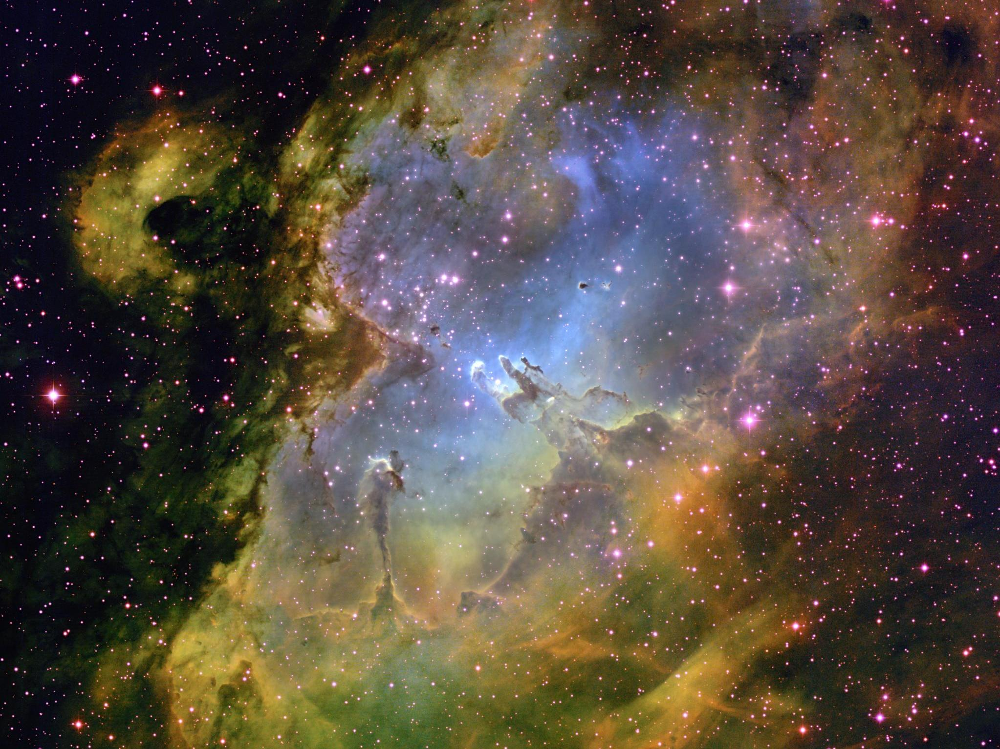

<!--Contributors: Markus,Prannaya-->

# Molecular clouds

</img>

In the beginning, there was nothing but space and gas. A lot, a lot of gas. 

## Description

A molecular cloud is a cloud of light gas (mostly H$_2$) and dust. These humongous clouds tend to take on twisted, long shapes, usually described as "_filamentary_". The temperature of these clouds can be as low as 10K, and span lightyears across in size.

If the mass of a cloud exceeds the threshold where pressure can maintain equilibrium, _gravitational collapse_ begins, and cloud fragments begin to implode until their cores are dense enough to be considered [a protostar](protostar.md).

## Stability 

In many giant molecular clouds the density for a long-lived stable equlibrium to exist. In addition to gas pressure, magnetic forces also oppose the contraction of gas within the molecular cloud.

Mostly, molecular clouds are too light, hot and magnetic for gravitational collapse to occur, so how does this happen? Usually cloud collapse is _triggered_ by an event such as the collision of gas clouds or gravitational waves from supernovae. These events compress the gas on astronomical scales, kickstarting the star formation process. 

The gravitational forces of the dust gradually begins to overcome gas pressure, turbulence, rotation, and the magnetic field of the cloud, leading to _cloud collapse_ at multiple points within the cloud. The waves and forces produced by these young stars pushes its surrounding gas together in a phenomenon known as _starbursts_ where for a period the rate of star formation in a molecular cloud is greatly increased.

??? Note "Extra"
    ## Extra
    ### Gravitational collapse

    In the 20th century, a scientist named James Jeans investigated this phenomenon of cloud collapse. Jeans found that fluctuations in size or mass larger than certain thresholds (now known as the Jeans Mass and Jeans Length) will cause instability in the molecular cloud and begin gravitational collapse.

    If the mass of a cloud exceeds the critical threshold (the Jeans Mass) where pressure can maintain equilibrium, _gravitational collapse_ begins, kickstarting the formation of a star.

    Sometimes, an external event starts off this process. In _triggered star formation_, colliding clouds or gravitational waves compress gas on astronomical scales, accelerating the star formation process. This causes a phenomena called _starbursts_, where the number of stars formed within the molecular cloud is much higher than normal levels.

    The Jeans Mass (for a gas cloud of uniform density $\rho_o$ is defined based of the following equation:

    $$
    \begin{align*}
    M_J &= \sqrt{\frac{(15k_\text{B}T)^3 \pi^5}{(128Gm)^3 \rho_o}} \\
    \text{where:  }& \\
    k_\text{B} &= 1.38065 \times 10^{-23}\text{ J K}^{-1} \\
    G &= 6.674 \times 10^{-11}\text{ m}^3\text{ kg}^{-1}\text{ s}^{-2} \\
    m &= 2m_p + 2m_e
    \end{align*}
    $$

    ??? Abstract "Derivation"

        Okay, for the sake of argument, assume the molecular cloud is spherical and is startignt to gravitationally collapse. The time taken for the collapse to occur is know as the **free fall time**.

        As with general free-fall, the acceleration at any point on the edge of the cloud is governed by the central equation:

        $$g = -\frac{GM}{R^2}$$

        Assuming this spherical cloud (of initial radius $R_o$) is in fact homogenously distributed with an average density $\rho_o$, then we can get the following:

        $$
        \begin{align*}
        \ddot R &= -\frac{G}{R^2} \times \rho_o \times \left(\frac{4}{3}\pi R_o^3 \right) \\
        &= -\frac{4}{3}\frac{G\pi\rho_o R_o^3}{R^2} \\
        \text{Noting that }\frac{d\dot{R}}{dR} &= \frac{\ddot{R}}{\dot{R}} \\
        \text{Integrating both sides}&\text{ by R,} \\
        \int_0^{\dot{R}} \dot{R}\text{ } d{\dot{R}} &= -\frac{4G\pi\rho_o R_o^3}{3} \int_{R_o}^R R^{-2}\text{ } dR \\
        \frac{1}{2}\left(\dot{R}\right)^2 &= \frac{4G\pi\rho_o R_o^3}{3} \left( \frac{1}{R}-\frac{1}{R_o} \right) \\
        \dot{R} &= -\sqrt{\frac{8G\pi\rho_o R_o^2}{3}\left(\frac{R_o}{R} - 1 \right)}  \\
        t_c &= \int_{R_o}^0 \frac{dR}{\dot{R}} \\
        &= -\sqrt{\frac{3}{8G\pi\rho_o R_o^2}} \int_{R_o}^0 \left(\frac{R_o}{R} - 1 \right)^{-\frac{1}{2}} \text{ } dR \\
        &= \sqrt{\frac{3}{8G\pi\rho_o R_o^2}} \frac{\pi R_o}{2} = \sqrt{\frac{3\pi}{32G\rho_o}}
        \end{align*}
        $$

        On the other side, you have that there will be sound waves released upon the start of collapse, which much rebound and return before the above $t_c$ to have enough pressure to counteract the gravitational collapse. Otherwise, total gravitational collapse occurs and the star begins to form. This is known as the **sound-crossing time**. Notably, we know that the speed of sound in an ideal diatomic gas of particle mass $m$ is:

        $$c_s = \sqrt{\frac{5k_B T}{m}}$$

        For it to rebound and arrive, the time taken must be:

        $$t_s = \frac{2R_0}{c_s} = \sqrt{\frac{4mR_0^2}{5k_B T}}$$

        At critical mass, we have that $t_c = t_s$,

        $$
        \begin{align*}
        \sqrt{\frac{4mR_J^2}{5k_B T}} &= \sqrt{\frac{3\pi}{32G\rho_o}} \\
        \frac{4mR_J^2}{5k_B T} &= \frac{3\pi}{32G\rho_o} \\
        R_J &= \sqrt{\frac{15\pi k_\text{B} T}{128 G m \rho_o}} \\
        M_J = \frac{4}{3} \rho_o \pi R_J^3 &= \sqrt{\frac{(15k_\text{B}T)^3 \pi^5}{(128Gm)^3 \rho_o}}
        \end{align*}
        $$

    When a cloud's mass exceeds the Jeans Mass, the gravitational forces of the dust gradually begins to overcome gas pressure, turbulence, rotation, and the magnetic field of the cloud. This leads to _cloud collapse_, where gas collapses inwards into balls at multiple points within the molecular cloud, forming smatterings of dustballs known as...
    The Jeans mass was derived from examining the point at which grevitational potential energy increases exceed the pressure increase which opposes the collapse.

_References_

[1] https://science.nasa.gov/astrophysics/focus-areas/how-do-stars-form-and-evolve

[2] https://en.wikipedia.org/wiki/Star_formation 

[3] Kenneth R Lang, Essential Astrophysics
