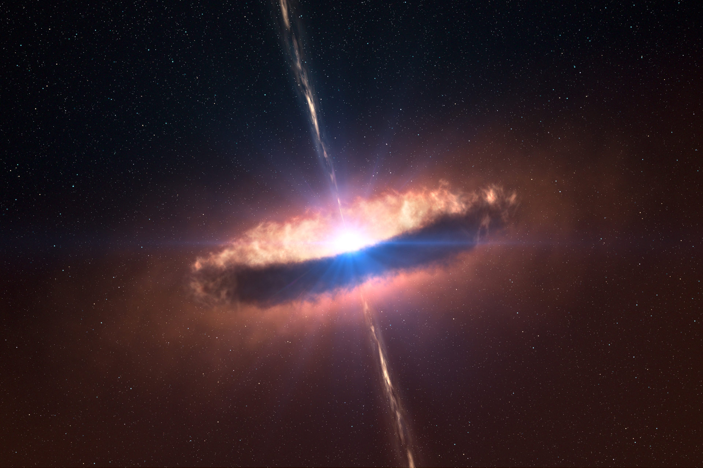
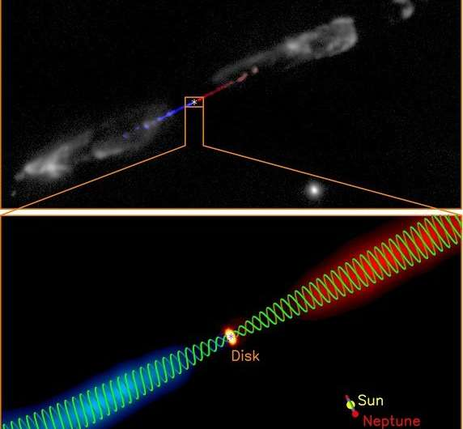
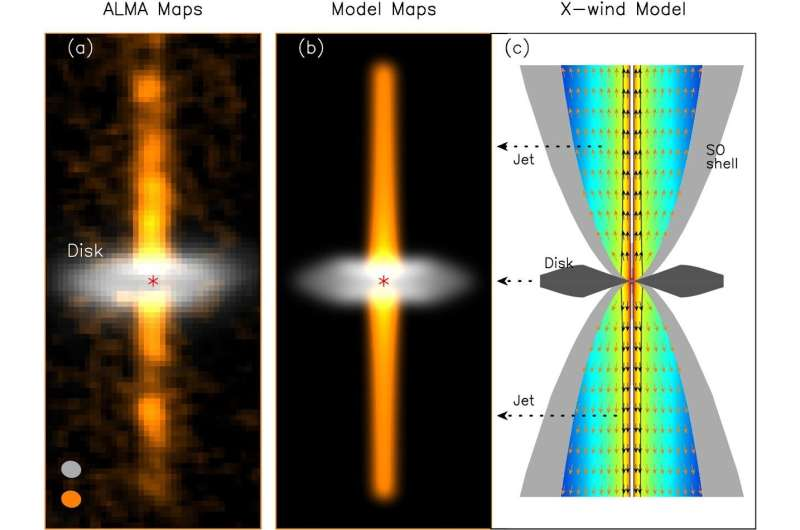

<!--Contributors: Markus-->

# The Protostar

{ align=center }

## The Protostar

A protostar is a young star which is still gathering mass from its parent molecular cloud through a process called accretion. In this state, it is not yet hot enough for hydrogen fusion to occur. 

Gravity pulls gas into a disk-like shape around the protostar, called a _circumstellar disk_. _Accretion_(Or collection) of dust from the circumstellar disk continues until the star is hot enough to reach a state of hydrostatic equilibrium. This accretion is the main source of energy for the star, as shock from matter smashing into the face of the star is turned into heat. 

At first, heat is lost rapidly to the void of space through radiation. However, as its mass increases, the protostar gradually becomes opaque to its own radiation. Heat can no longer escape and begins accumulating at the core of the nascent star.

When the heat reaches a certain threshold, thermoneuclear reactions are triggered and heat is released into its outer shell, signalling the birth of a pre-main-sequence star.  

If its mass is between 2 and 10 solar masses, it turns into a [Herbig Ae/Be star](./herbig-ae-be.md), and if its mass is less than 2 solar masses it turns into a [T-tauri star](./t-tauri.md)

!!! note
    Some believe stars of mass lower than 0.5 solar mass never enter the T-tauri phase. However, there is also conflicting (but not conclusive) results suggesting the existence of a T-tauri phase in brown dwarfs. See [3].

## Protoplanetary Disks

Gas initially collapses towards the dense core of the protostar, but also begins to form a protoplanetary disk. The protoplanetary disk (Not to be confused with an accretion disk), as mentioned earlier, is where the protostar pulls in its mass from. 

As the protostar collapses under its own gravity, conservation of angular momentum causes the rotation of the star to speed up. Centripital accelleration from the rotation resists the radial pull of the star, while axially the outer shell continues to collapse. 

### Planet Formation

From this relatively stable disk around the star, planets can form. It is widely believed that our solar system was birthed out of a system like this. Electrostatic and gravitational effects pull clumps of dust together against the push of stellar wind to create planetesimals. If the outward pushing solar wind and inward pulling gravity are stable for long enough, these planetesimals accrete into planets. 

## Protostellar Jets

Many depictions of protostars show jet-like shapes appearing to come axially out of the protostar. These mysterious structures are called protostellar jets, and though their origin is yet unknown, they play an important part in supporting the protostar. 

The most popular theory for their formation is that they are ejected from the protostellar disks by wide-angle winds, and are then collimated by the toroidal magentic fields.

    </img>
    </img>  
    <i style="font-size:0.8em">Diagrams of the magnetic field and flow of the protostellar jets respectively, from [5] and [6].</i>

## References

[1] http://sunshine.chpc.utah.edu/Labs/StarLife/protostars.html

[2] https://www.astronomynotes.com/evolutn/s3.htm

[3] https://ui.adsabs.harvard.edu/abs/2003ApJ...592..282J/abstract 

[4] https://en.wikipedia.org/wiki/Lithium_burning

[5] https://phys.org/news/2022-03-uncovering-magneto-centrifugal-protostellar-jets.html

[6] https://phys.org/news/2018-11-magnetic-fields-jet-baby-star.html