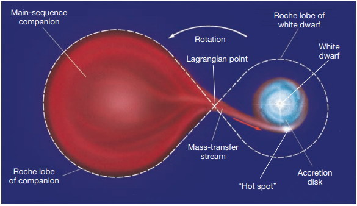
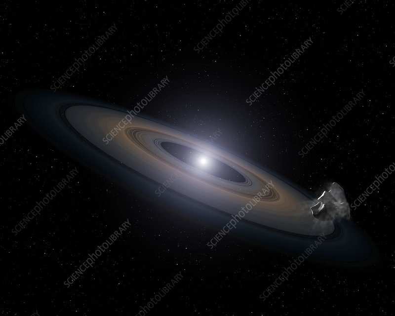

# Binary White Dwarves

Previously, we have considered stars as isolated systems that evolve independently. However, most stars in the universe exist not as isolated stars, but as binaries, where two stars orbit their shared center of mass. When one of the stars in a binary system becomes a white dwarf, it forms what is known as a **Binary White Dwarf System**. 

## Recap: White Dwarves

A white dwarf is the remnant of a dead star -- only inert carbon that does not fuse remains, remaining light coming from only its remaining heat. Usually, a white dwarf will simply cool as it radiates its remaining heat, eventually forming a black dwarf. However, in a binary system, the white dwarf has the potential to evolve further -- and in far more spectacular ways.

## Stealing Gas

In a binary white dwarf system, the white dwarf's gravitational field can begin to pull gas from its partner to itself -- in other words, the size of its partner exceeds their Roche lobe, or the sphere of their gravitational influence. The result is that the white dwarf slowly gains gas from its partner. This occurs most when its partner is also reaching the end of its main sequence and has expanded to a red giant. 

     Accretion of mass from a Red Giant</img>

This process, where the white dwarf gradually gains mass from its partner, is known as **accretion**.

## Accretion Disks

While the white dwarf attempts to pull mass from its partner straight towards itself, the spinning of the entire binary star system as well as the small size of the white dwarf makes it very easy for the mass to "miss" the white dwarf and go into orbit around it instead. A combination of tidal forces and the centripetal force from the gravitational pull stretches the gas into a thin, round layer surrounding the white dwarf, which is visible as an **accretion disk**.

     An accretion disk around a White Dwarf</img>

As gas particles in the swirling disk collide, they will lose energy and be unable to sustain their existing orbital position, falling towards the white dwarf's surface. As the gas falls, it heats up -- so hot that it begins to radiate with peak wavelengths in visible and even ultraviolet and X-ray ranges, radiating light that outshines the white dwarf itself. 

## Gas Buildup, Novas and Supernovas

As the gas accumulates on the white dwarf surface, it becomes hotter and denser as the pressure too increases. At a critical point, the hydrogen ignites and begins to fuse into helium, forming a **nova**. In an even more extreme case, the white dwarf gains so much mass that its gravity can no longer be balanced by the repulsion from its degenerate electrons, and the entire white dwarf collapses on itself and explodes in a **Type Ia supernova**.

## What Comes Next?
- [Novas](../nova/nova.md)  
- [Type Ia Supernovas](../nova/type_1a_supernova.md)

## *References*
- https://www.nationalgeographic.com/science/article/white-dwarfs
- https://www.skyatnightmagazine.com/space-science/accretion-disk/
- Astronomy Today
- Images sourced from Astronomy Today and Science Photo Library
