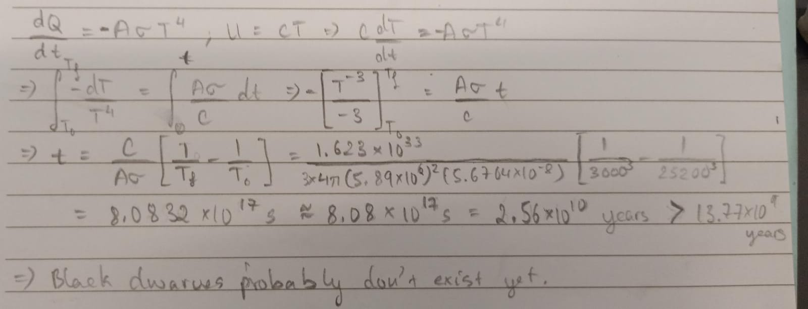

# Black Dwarves

## Genesis
As the white dwarfs cannot produce any energy, it will simply radiate away the left-over energy from its previous phases. Eventually, it will run out of energy and become the **black dwarf**.

## Dark Matter Candidate?
### What is Dark Matter?
Now, astronomers noticed that galaxies are spinning a bit too fast for the mass that they can observe it to possess. As such, they hypothesize that there must be some massive unobservable substance that is contributing to the mass of the galaxy. This substance was termed as **dark matter**.

### What would a dark matter candidate look like?
We would expect a dark matter candidate to be something with **a lot of mass** and **very hard to detect**. We see that black dwarves satisfies both of these criteria, as it possess the mass of a star - making it very massive. And it is very small and doesn't emit light, making it very hard to detect.
As such, it is quite an interesing exercise to entertain the possibility that black dwarves are actually what is responsible for the phenonmenon we call **dark matter**.

### Why isn't it discussed in science more?
Black dwarves are theoretical objects, and have never been observed. The time it takes for a white dwarf to become a black dwarf is longer than the life-time of the universe. Hence, scientists believe that it is improbable that black dwarves are responsible for the dark matter anomaly, lest our current physical theoreies are wrong in some limit.

## Questions
Show that the time it takes for white dwarves to cool down to black dwarves is longer than the hypothesized age of the universe (13.77 billion years!). Given that white dwarf must cool down to $3000\ K$ to be considered a black dwarf, take the initial temperature of the white dwarf to be that of Sirius B, $25200\ K$. Furthermore, take the heat capacity of the white dwarf to be $1.623\times10^{33}\ J/K$ and that the radius of Sirius B is $5.89\times10^6\ m$

??? Abstract "Solution"
	

    	</img>
	

### Postface
The heat capacity of the dwarf was calculated by taking the molar heat capacity of carbon ($C = 10\ J/molK$) and multiplying it by $M_{Sirius B}/(12.01)$.

<!--
### Why isn't there a lot of literature on this topic?
Though it is an interesting thought, why isn't there more literature on this topic? 
Why did I only know about this until I started looking into black dwarves? 
My general incompetence can account for the latter question; however, for the former question, the common reason thrown around is that black dwarves is a theoretical object and that the expected life-time of the universe is less than the time expected for white dwarves to cool down to black dwarves. 
However, it is my firm belief that the actual reason is much more sinister than this. I believe that the reason why there isn't much literature into the black dwarf-dark matter theory is because the money hungry and smelly particle physicists are supressing the truth from getting out. 
Think about it, most of the funding that goes into particle physics and most of the rationale for hogging more government budget and building larger and larger colliders is the false promise of delivering a complete account for dark matter. So if people were to found out that "dark matter" is simply black dwarves, they won't receive any more funding. Thus, as they currently one of the most funded physics research domain, they wouldn't want this to happen as they would lose all their money.

## Problems
!!! Question "Is black dwarves a correct explanation to the "dark matter" phenonmenon?"
	

	<button class='md-button quizNormal' id="q1_1" onClick="markQ1(0)">Yes</button>
	<button class='md-button quizNormal' id="q1_2" onClick="markQ1(1)">Yes</button>
	

	

-->
