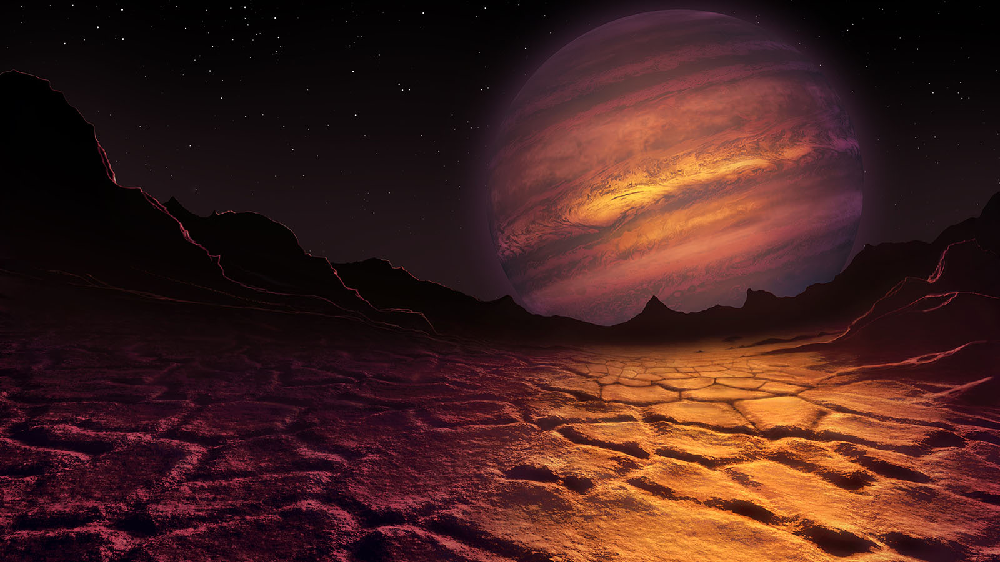
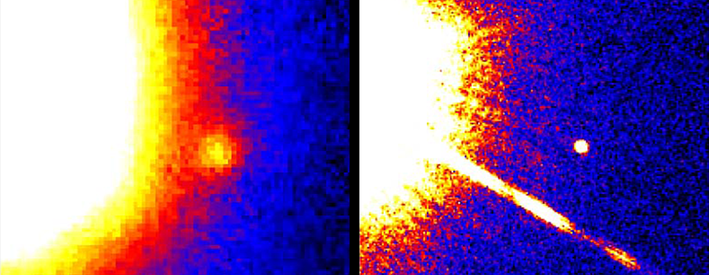

# Brown Dwarves

</img>

## Definition

Brown dwarves are substellar objects too light to sustain the hydrogen burning required to maintain the temperature of a main-sequence star, hence are often referred to as "failed stars". They are typically very cool (<600K) because of this, emitting wavelengths primarily in the infrared spectrum and relying on energy from gravitational collapse to supply heat. [3]

Brown dwarves are very similar to large planets, but are typically distinguished from planets through one of two ways. The first is how the body is formed, with dwarves forming in gravitational collapse while planets forming through accretion of planetesimals. However, because of the difficulty in ascertaining the origin of observed objects astronomers often opt for a simpler criterion of the mass of the object.

Brown dwarves are fuzzily defined as objects in the range between about 0.013 M⊙ and 0.072 M⊙[1, 6], but people argue about the precise thresholds often. Brown dwarves on the higher end of the mass spectrum (>60 M_j or ~0.0573M⊙) are supported by electron degenracy pressure, while the less massive ones are held stable by Coulomb pressure. [4]

## Deuterium burning

In brown dwarves, the self-gravity is insufficient for hydrogen burning to occur, but a process called deuterium burning can occur. 

$$
^2_1\text{H} + ^1_1\text{H}\rightarrow\ ^3_2\text{He} + \gamma
$$

Deuterium fusion actually takes place in the hydrogen fusion process seen in main sequence stars. It is through deuterium burning and the gravitational collapse that brown dwarfs are still able to shine for about 10 million years after formation.

??? Note "Extra"
    ## Extra
    ### History

    Brown dwarves were introduced as a way to compensate for the large number of observed objects with low temperatures (<1300K), and the first verified observation of a brown dwarf, Gliese 229B, was in 1995.

    

    </img>
    <i>[2] observations from 60-inch and 200-inch telescopes on Mount Palomar</i>
    

    Gliese 229B, and many other brown dwarves since then, were discovered by surveying the area surrounding binary star systems. In the above image, Gliese 229B has a luminosity of only a few millionths that of the Sun. Because they are so small and dark, brown dwarves are very difficult to detect. 

    Apart from this, infrared surveys and spectroscopic studies present additional ways to search for brown dwarves. 

    ### Sub-brown dwarves

    The astute reader may have noted that protostars less than 0.08M⊙ in mass turn into brown dwarves, but the definition of brown dwarves does not encompass that below 0.013M⊙. What's going on there? Well, a brown dwarf is typically indicated by its ability to conduct deuterium fusion. Below the mass of 0.013M⊙, the force of gravity is insufficient to support deuterium fusion. 

    Typically low-mass objects like these are considered planets, but referring to them as planets in this case may lead to confusion, since they were formed in cloud collapse. In these cases, we call the object a sub-brown dwarf or planetary-mass brown dwarf.

    ### Classification

    Brown dwarves are typically classified broadly based on their spectral class. However, since the temperature of brown dwarves tends to fall lower than the lowest usual M classification, L T and Y classifications (which are almost exclusively used for brown dwarves) are employed. 

    Class M brown dwarves are characteristically very close to red dwarves, as they encroach on the lowest corner of the main sequence. Most scientists consider a star of class M6.5 or lower to be a brown dwarf[7]. 

    Class T and L dwarves dwell between 550 and 1,300 K and 1,300 to 2,000 K bands respectively. These small brown dwarves are often formed from a proplyd (protoplanetary disk) whose gas has been lost to nearby protostar.

    Class Y dwarves are very difficult to spot, as their temperature is that below 550K. Some Y-class dwarves have been observed, but it is difficult to observe patterns in their spectral sequences and properties. 

[1] _An introduction to modern astrophysics_ 

[2] https://hubblesite.org/contents/news-releases/1995/news-1995-48.html 

[3] _Astrigue_

[4] https://arxiv.org/ftp/astro-ph/papers/0608/0608417.pdf

[5] https://en.wikipedia.org/wiki/Brown_dwarf 

[6] https://www.quantamagazine.org/neither-star-nor-planet-a-strange-brown-dwarf-puzzles-astronomers-20210804/ 

[7] https://www.scienceabc.com/nature/universe/what-are-brown-dwarfs.html 
