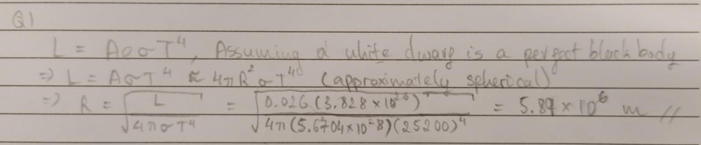
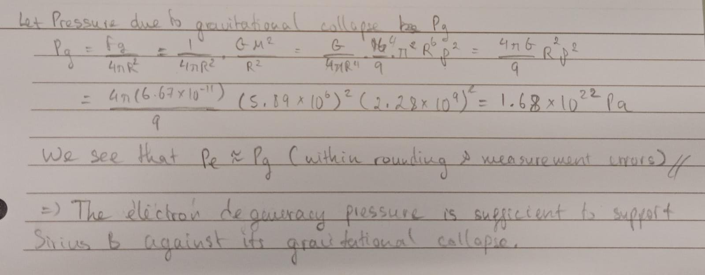

# White Dwarves

## Genesis

As the red giant runs out of helium to burn, the core undergoes gravitational collapse as there is no longer any countervailing pressure preventing this from happening. As it collapses, gravitational energy is released, heating up what is an already very hot core. Eventually, once the matter gets squeeze together close enough, electron degeneracy pressure kicks in, preventing further collapse of the core.
The result of this is a very hot but relatively dim **white dwarf**.

## Electron Degeneracy Pressure

**Electron degeneracy pressure** arises as a result of *Pauli's Exclusion Principle* which forbids two electrons (or more generally two fermions) from occupying the same quantum state at the same time. If two electrons are forced into these conditions, one would quickly dart away in order to not occupy the space of another. This movement of electrons creates a form of pressure that pushes against gravity, halting the star's gravitational collapse. This pressure is known as the **electron degeneracy pressure**.
Furthermore, it has been shown that the speed at which these electrons dart away are in the relativistic regime. In which case, the electron degeneracy pressure can be calculated as
$$
P_e \approx \left(\frac{3}{8\pi}\right)^{1/3}\frac{hc}{4m_p^{4/3}}\left(\frac{Z}{A}\right)^{4/3}\rho^{4/3}
$$

??? Abstract "Derivation of Electron Denegeneracy Pressure (Optional)"

	We have the following pressure integral for calculating the pressure given a distribution.
	$$
	P = \frac{1}{3}\int_0^{\infty} pv_pn(p)dp
	$$

	The Fermi-Diract distribution function for fermions is given by
	$$
	n(p)dp = g_s\frac{4\pi p^2}{h^3}dp\left[\frac{1}{e^\frac{(E - \mu)}{kT} + 1}\right]
	$$
	As electrons have spin $s = 1/2$, we have $g_s = 2s + 1 = 2$ 
	The fraction $\frac{1}{e^\frac{(E - \mu)}{kT} + 1}$ is the occupation number, and for a degenerate gas it is 1. 
	Hence we have the distribution function for degenerate electrons in a white dwarf to be
	$$
	n(p)dp = \frac{8\pi p^2}{h^3}dp
	$$
	Subbing into the pressure integral, we have
	$$
	P_e = \frac{1}{3}\int_0^{p_f} p v_p\frac{8\pi p^2}{h^3}dp
	$$
	We can replace $\infty$ with $p_f$ because there are no electrons with momentum above the Fermi momentum.
	For electrons travelling at relativistic speeds, the momentum is given by
	$$
	p = \gamma m_e v = \frac{m_ev}{\sqrt{1 - (v/c)^2}}
	$$
	Hence, we can express the velocity as
	$$
	v = \frac{p/m_e}{\sqrt{1 + (p/m_ec)^2}}
	$$
	Subbing that back in, we have
	$$
	P_e = \frac{1}{3}\int_0^{p_f} p \frac{p/m_e}{\sqrt{1 + (p/m_ec)^2}}\frac{8\pi p^2}{h^3}dp
	$$
	Setting $x = p/m_ec$ and $x_f = p_f/m_ec$, we have
	$$
	P_e = \frac{8\pi(m_ec)^5}{3h^3m_e}\int_0^{x_f}\frac{x^4}{\sqrt{1 + x^2}}dx
	$$
	In the limit where the electron travels close to the speed of light (which is the case in a white dwarf), we can approximate $1 + x^2\approx x^2$. Hence, we have
	$$
	P_e \approx \frac{8\pi(m_ec)^5}{3h^3m_e}\int_0^{x_f}\frac{x^4}{\sqrt{x^2}}dx
	$$
	$$
	\Rightarrow P_e \approx \frac{8\pi(m_ec)^5}{3h^3m_e}\int_0^{x_f}x^3dx
	$$
	$$
	\Rightarrow P_e \approx \frac{8\pi(m_ec)^5}{3h^3m_e}\frac{x_f^4}{4}
	$$
	Subbing back $x_f = p_f/m_ec$, we have
	$$
	P_e \approx \frac{8\pi c}{3h^3}\frac{p_f^4}{4}
	$$

	Now we have the number density of electrons as
	$$
	n_e = \int_0^\infty n(p)dp = \int_0^{p_f} n(p)dp
	$$
	We replaced $\infty$ by $p_f$ by the reason above, subbing in the derived expression for $n(p)dp$, we have
	$$
	n_e = \int_0^{p_f} \frac{8\pi p^2}{h^3}dp = \frac{8\pi}{h^3}\frac{p_f^3}{3}
	$$
	$$
	\Rightarrow p_f = \left(\frac{3h^3}{8\pi}n_e\right)^{1/3}
	$$
	Subbing back into the expression for the electron degeneracy pressure, we have
	$$
	P_e \approx \frac{8\pi c}{3h^3}\frac{{\left(\frac{3h^3}{8\pi}n_e\right)^{4/3}}}{4}
	$$
	$$
	\Rightarrow P_e \approx hc\left(\frac{3}{8\pi}\right)^{1/3}\frac{n_e^{4/3}}{4}
	$$
	We can express electron number density in terms of total matter density as
	$$
	n_e = \rho/m_H\mu_e
	$$
	From [low-mass stars](../stars/low_mass_star.md), we have the mean molecular weight as
	$$
	\mu = \frac{\overline m}{m_H}
	$$
	In the case of electrons, we have the average nuclear mass as
	$$
	\overline m = \frac{Zm_p}{A}
	$$
	From which, we an express the electron number density as
	$$
	n_e = \rho\frac{A}{Zm_p}
	$$

	Subbing $n_e$ back into our expression earlier, we arrive at the following formula for electron degeneracy pressure
	$$
	P_e \approx \left(\frac{3}{8\pi}\right)^{1/3}\frac{hc}{4m_p^{4/3}}\left(\frac{Z}{A}\right)^{4/3}\rho^{4/3}
	$$

	Reference: [Derivation of ultra-relativistic electron degeneracy pressure](https://scholarworks.wmich.edu/cgi/viewcontent.cgi?article=5320&context=masters_theses)

## A Hot Dim Star

Eventhough the white dwarf is very hot, it is abnormally dim. This is because it is very small, causing it to not have enough surface area to emit much light. Consulting the Stefan-Boltzmann Law, we find that
$$
L = A\sigma eT^4
$$
So if the area of the star is sufficiently small, it can overpower the forth power on the temperature term.

## All Good Things Must Come to an End.
As there is no energy production happening in the white dwarf, its brightness if purely sustained by the left-over heat from its red giant phase and is gravitational collapse. Thus, eventually, all these heat will burn off causing the white dwarf to become a dark and frozen star, a [black dwarf](black_dwarf.md)

## Problems

</img>
 
Figure 1: Artist's illustration of Sirius binary system

Sirius B is a white dwarf, and is the companion to a main-sequence star named Sirius A in the Sirius [binary star system](../dwarves/binary_white_dwarf.md)

### Question 1: A white dwarf's radius

Given that the effective disk temperature of Sirius B is $T_{eff} = 25200\ K$, and that its absolute luminosity is $L = 0.026 L_\odot$. Where the sun's luminosity is $L_\odot = 3.828\times10^{26}\ Js^{-1}$. Find the radius of Sirius B.

??? Abstract "Solution"
	

    	</img>
	

### Question 2: Mass
The mass of Sirius B is calculated to be $M = 0.98M_\odot$, where $M_\odot = 1.989\times10^{30}\ kg$. Find the density of Sirius B.

??? Abstract "Solution"
	

    	</img>
	

### Question 3: Electron deneracy
Using the equation for the electron degeneracy pressure in the previous section, show that it is sufficient to support Sirius B.

??? Abstract "Solution"
	

	    </img>
	

	

    	</img>
	

