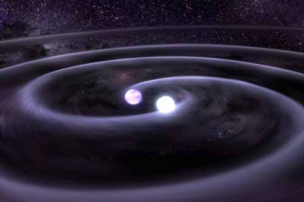

# White Dwarves

## Genesis

As the red giant runs out of helium to burn, the core undergoes gravitational collapse as there is no longer any countervailing pressure preventing this from happening. As it collapses, gravitational energy is released, heating up what is an already very hot core. Eventually, once the matter gets squeeze together close enough, electron degeneracy pressure kicks in, preventing further collapse of the core.
The result of this is a very hot but relatively dim **white dwarf**.

## Electron Degeneracy Pressure

**Electron degeneracy pressure** arises as a result of *Pauli's Exclusion Principle* which forbids two electrons from occupying the same quantum state at the same time. If two electrons are forced into these conditions, one would quickly dart away in order to not occupy the space of another. This movement of electrons creates a form of pressure that pushes against gravity, halting the star's gravitational collapse. This pressure is known as the **electron degeneracy pressure**.

### Derivation of Electron Denegeneracy Pressure

_\<Something something Fermi statistics and Special Relativity\>_

We arrive at the following formula for electron degeneracy pressure
$$
P_e = \left(\frac{3}{8\pi}\right)^{1/3}\frac{hc}{4m_p^{4/3}}\left(\frac{Z}{A}\right)^{4/3}\rho^{4/3}
$$

## A Hot Dim Star

Eventhough the white dwarf is very hot, it is abnormally dim. This is because it is very small, causing it to not have enough surface area to emit much light. Consulting the Stefan-Boltzmann Law, we find that
$$
L = A\sigma eT^4
$$
So if the area of the star is sufficiently small, it can overpower the forth power on the temperature term.

## All Good Things Must Come to an End.
As there is no energy production happening in the white dwarf, its brightness if purely sustained by the left-over heat from its red giant phase and is gravitational collapse. Thus, eventually, all these heat will burn off causing the white dwarf to become a dark and frozen star, a [black dwarf](black_dwarf.md)

## Problems

</img>
 
Figure 1: Artist's illustration of Sirius binary system

Sirius B is a white dwarf, and is the companion to a main-sequence star named Sirius A in the Sirius [binary star system](../dwarves/binary_white_dwarf.md)

### Question 1: A white dwarf's radius

Given that the effective disk temperature of Sirius B is $T_{eff} = 25200\ K$, and that its absolute luminosity is $L = 0.026 L_\odot$. Where the sun's luminosity is $L_\odot = 3.828\times10^{26}\ Js^{-1}$. Find the radius of Sirius B.

??? Abstract "Solution"
	*Add solution here later*

### Question 2: Mass
The mass of Sirius B is calculated to be $M = 0.98M_\odot$, where $M_\odot = 1.989\times10^{30}\ kg$. Find the density of Sirius B.

??? Abstract "Solution"
	*Add solution here later*

### Question 3: Electron deneracy
Using the equation for the electron degeneracy pressure in the previous section, show that it is sufficient to support Sirius B.

??? Abstract "Solution"
	*Add solution here later*