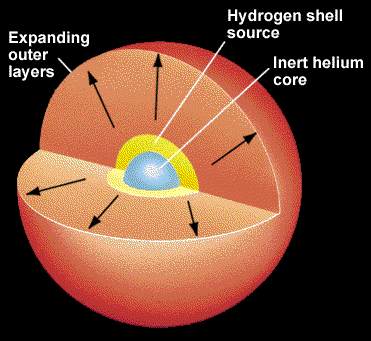
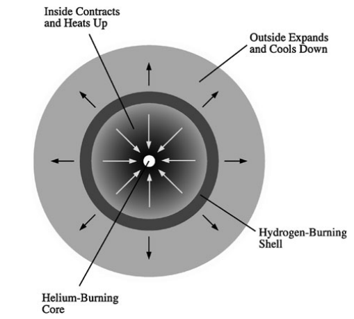
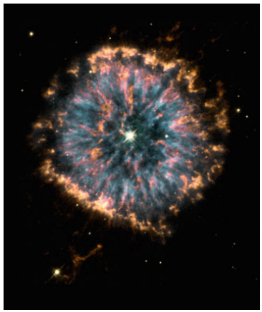

<!--Contributors: Khang-->
# Red Giants
!!! definition
    The late stage evolution of a low-mass star.

</img>
 
Figure 1: Diagram of a red giant

## Genesis

After hydrogen burning ceases in a [low mass star](../stars/low_mass_star.md), its inert helium core is unable to support itself against gravitational collapse. As the core collapses, it releases gravitational potential energy which heats up the unreacted envelope of hydrogen surrounding it. This increase in temperature causes the envelope to expand, thus resulting the star becoming larger, hence *giant*.

## The **Red** Giant

As the core collapses, there comes a point where the conditions are right for *helium fusion* or *helium burning* to start. This unleashes an abundance of energy to the outer envelope, enough to kick start [*hydrogen burning*](../stars/low_mass_star.md) in a small shell encompassing the core. The combined effect of both helium burning and hydrogen burning allows the giants to glow more brilliantly than the low-mass stars. 
Furthermore, the outer envelope continues to expand and cools down, causing the **red** giant to appear more red.

</img>
 
Figure 2: Reactions in the red giant

## Burning Helium

In 1951, Öpik realised that helium burning can take place in the core at a sufficiently high temperature (around 100 million Kelvins). The reaction involves a triple collision of helium nuclei to form a carbon nuclei.
$$
^4 \text{He} + ^4 \text{He} + ^4 \text{He}\rightarrow ^{12}\text{C} + \gamma
$$

Surprisingly, the triple collision happens very frequently in the immensely hot core of the star that enough energy is produced to power the red giant's intense luminosity.

## Helium Depletion

As the cores runs out of helium to burn, it sheds its outer gaseous envelope, which is too diffused to undergo gravitational collapse so it just gets blown out by stellar winds resulting in beautiful formations, called [planetary nebulae](../others/planetary_nebula.md).

</img>
 
Figure 3: Cat eye nebula

_**Elaborate on each concept further later**_

