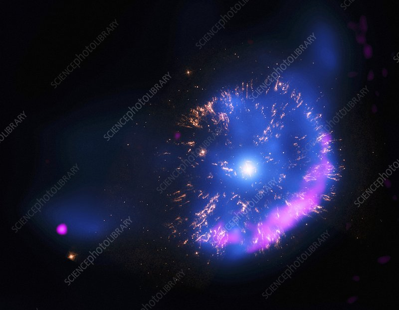

# Nova
Novas are stars that have sudden, large increases in brightness before fading back to their original brightness. Stargazers of ancient times believed that new stars were created, as the bursts of light seemed to appear from nowhere in the night sky -- hence their name *nova*, which means "new" in Latin. 

Astronomers today now know that novas are not, in fact, new stars, but rather white dwarves -- stars that have already reached the end of their main sequence and are now husks of mainly carbon and oxygen. 

## Where does the light come from?
White dwarves are stars that are "dead": nuclear fusion no longer occurs in them, and their faint white glow comes from the radiation they produce due to whatever temperature they have left -- not a likely source of a burst of light.

In reality, novas cannot occur with any white dwarf, but rather only those that are in **[Binary White Dwarf Systems](../dwarves/binary_white_dwarf.md)**. In a binary white dwarf system, the white dwarf tends to attract gas from its partner to itself, which forms an **accretion disk** around the white dwarf. The gases in the accretion disk cannot keep on orbiting the white dwarf forever -- resistive forces caused by viscosity in the gas surrounding the white dwarf cause the gas to slow down and fall towards the white dwarf, eventually landing on its surface. As more gas builds up on the surface of the white dwarf, it gets hotter and denser.

Eventually, the hydrogen gets hotter and hotter until reaching a critical point of about 20 million Kelvin, at which point the hydrogen ignites and begins to undergo nuclear fusion into helium. As a refresher, this nuclear reaction is exactly the same as the reaction that the cores of stars in their main sequence undergo to produce their energy.

$$
4\ce{^{1}_{1}H} + 2\ce{^{0}_{-1}e} \rightarrow \ce{^{4}_{2}He} + 2\nu
$$

The fusion reaction releases a very large amount of energy, resulting in radiation in the visible range. The rapid heating causes the gas to expand rapidly, blowing most of it into space, where it then cools down. This is why novas flare up suddenly and then slowly fade back to their normal brightness. 

    The still-bright gas from after a nova explosion</img>

## The Cycle Continues
The gas from the nova is largely blasted off into space and the white dwarf cools back to its original temperature. This marks a return to the original binary white dwarf system, where the white dwarf can go nova again, or even turn into a **[Type Ia Supernova](type_1a_supernova.md)** for an even more spectacular burst of light.

[Next: Binary White Dwarves](../dwarves/binary_white_dwarf.md)

## Test Yourself!
### Question: Visible Novas

!!! Question "Which of the following is not true of novas?]?"
	

	<button class='md-button quizNormal' id="q1_1" onClick="markQ1(0)">Novas are observed as bursts of short-lived brightness</button>
	<button class='md-button quizNormal' id="q1_2" onClick="markQ1(1)">The same star can become a nova multiple times</button>
    <button class='md-button quizNormal' id="q1_3" onClick="markQ1(2)">The energy from novas comes differently from in normal stars</button>
	

	

??? Abstract "Solution and Explanation"
	_The last statement is false. Novas glow bright due to the energy release of hydrogen fusion, exactly the same as in the cores of stars._

*References:*

https://www.universetoday.com/131577/what-is-a-nova/ \
Astronomy Today \
Image from the Science Photo Library
