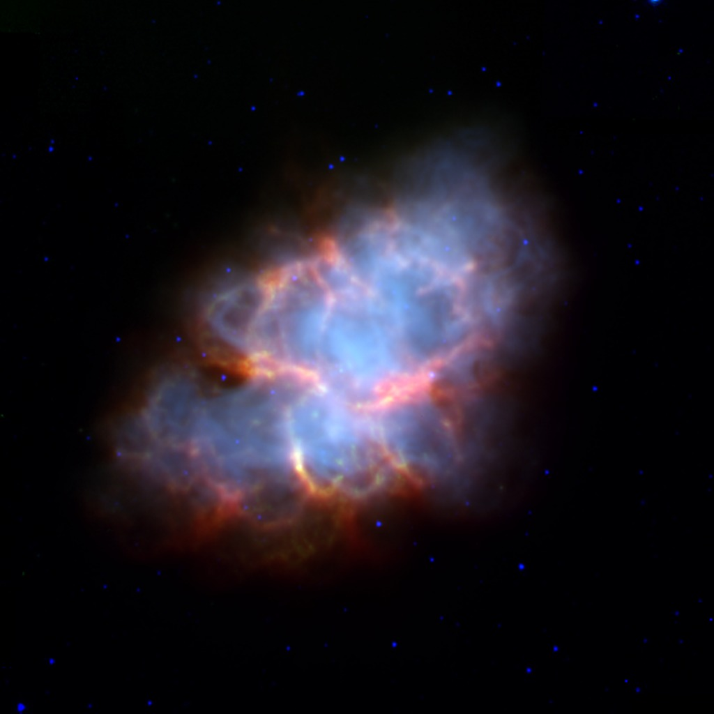
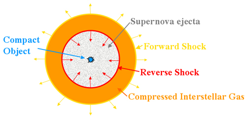
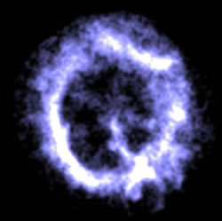
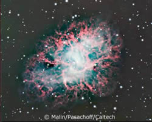
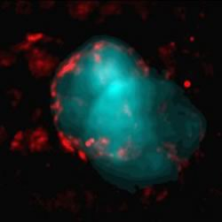

# Supernova Remnant

Supernova explosions are some of the brightest and highest-energy events in the universe, and the wake of their explosions can be observed from even centuries after their occurrence. These diffuse phenomena that we can still see from Earth are known as **Supernova Remnants**. 

One of the most well-known supernova remnants is the **Crab Nebula**, the remnant of a supernova that exploded close to nine centuries ago. Astronomers have recognised that the Crab Nebula must have resulted from an explosion due to how the gas cloud expands, creating a Doppler shift in the emission spectral lines that we can observe.

    An image of the Crab Nebula</img>

## The formation of a Supernova Remnant

The explosion of a supernova throws a huge mass of gas and stellar material away from the center, resulting in a large, expanding region of superheated material. This expanding gas cloud sweeps up the interstellar material, hence accumulating even more matter within the expanding remnant.

The initial explosion of the supernova generates a shock wave that ripples outward from the star, passing through the stellar medium and into the interstellar space. Material that is hit by the shock wave is heated to very high temperatures reaching millions of Kelvin, and hence begin to emit X-rays. Recall that the peak radiation wavelength is given by Wien's displacement law, which states that 

$$
\lambda_{peak} T = b
$$

In certain cases, the explosion of the supernova also forms a reverse shock wave that collapses back towards the center of the explosion. This usually occurs due to an expanding shell hitting another mass of gass, and the pressure buildup forcing the first shell to collapse back inwards. This effect has been observed in Cassiopeia A, one of the most prominent supernova remnants we have found.

    A diagram showing the two shock waves as a supernova explodes</img>

## The phases of a Supernova Remnant
The supernova remnant cannot keep expanding forever — as it sweeps up more and more interstellar material, it will lose energy to it and begin to slow down. The interstellar gas reaches densities too high for expansion to take freely. At this point, due to the rapid expansion of the shells, the matter ejected by the supernova and the swept-up material from the interstellar medium have not had the time to mix; however as the material slows down **Rayleigh-Taylor** instabilities begin to appear. A Rayleigh-Taylor instability simply describes how when two fluids of different densities mix, the more dense one will start penetrating the less dense one and the two will begin to mix. This is exactly what occurs in the slowed supernova remnant.

As the remnant slows, it will also cool, radiating heat away from itself. Once the remnant cools to approximately 20 thousand Kelvin, the environment becomes stable enough for electrons to begin to recombine into heavier elements, which radiates even more energy. This is the final phase of the supernova remnant.

## The types of supernova remnant
Supernova remnants are largely divided into 3 types based on their observable shapes.

The first of these is known as the **shell type**, so named because the radiation originates largely from an outer shell of shocked material. When we see these remnants, they appear as a bright ring as we see the radiation from the outer ring. This phenomenon of having the outer portion more visible since there is more hot gas at the edges of our line of sight is known as **limb brightening**.

    A shell-type supernova remnant</img>

The second of these is known as the **crab type**, owing their appearance. As one might expect, the Crab Nebula shown earlier is indeed a crab-type supernova remnant. Unlike the shell-type remnants, which appear as a single bright ring with a hollow center, crab-type remnants have a **[pulsar](../others/pulsar.md)** at their center, which flings out electrons. The electrons moving at relativistic speeds interact with the magnetic field within the remnant created by the matter, emitting all forms of electromagnetic radiation in the form of **synchrotron radiation**. This causes the center of the remnant to appear bright as well.

    A crab-type supernova remnant</img>

The last type is simply known as the composite remnants, so named because they show properties of both the shell and crab types. There are two different ways this can occur: one of them is **thermal composites**, which radiate shell-like in radio waves and crab-like in X-rays, but another is plerionic composites, which appear crab-like but also manifest shell structures.

    A thermal composite supernova remnant. The red represents radio radiation, while the blue is x-rays.</img>

## The end of the star?

Supernova remnants remain as they are until they eventually radiate all their heat away. However, this process usually takes tens of thousands of years as the gases slowly cool, allowing them to remain visible for a very, very long time. 

Is the supernova truly the end of a star as all its mass is blown off into space? Not quite. While [Type I Supernovas](type_1a_supernova.md) are believed to be completely shattered, [Type II Supernovas](type_2_supernova.md) can leave behind a very highly compressed remnant that we now know as a **[Neutron Star](../others/neutron_star.md)**.

Next: [Neutron Stars](../others/neutron_star.md)

*References:*

https://www.spitzer.caltech.edu/image/sig05-004a-crab-nebula-supernova-remnant-spitzer-irac-mips \
https://astronomy.swin.edu.au/cosmos/s/supernova+remnant \
https://www.livescience.com/supernova-reverse-shock-wave
https://www.intechopen.com/chapters/71784
https://imagine.gsfc.nasa.gov/science/objects/supernova_remnants.html
https://astronomy.swin.edu.au/cosmos/S/supernova+remnant+type
