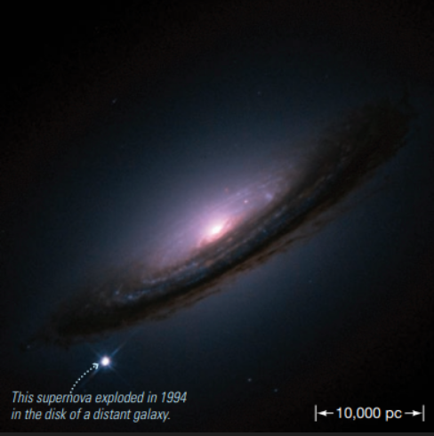

# Type Ia Supernova

White dwarves in binary systems slowly accrete mass from their partners, and can eventually turn into [novas](nova.md) or Type Ia Supernovas. Supernovas, as one can tell from the name, obtain their name as they flare up suddenly like novas, but have even greater brightness than them. Despite their similar names oweing to the similar phenomenon at the surface level, the mechanisms behind supernovas actually are quite distinct from that of novas. 

## Supernovas vs Novas

Supernovas were not well-understood for a long time, with astronomers puzzled on what differentiated them with the similarly bright novas. In particular, the perplexing discovery of how supernovas only rose in brightness once before disappearing as opposed to the recurring flares of novas. However, with us now knowing more about the process of how supernovas explode, we now have a better understanding of how they differ. 

The reason for supernovas occuring only once is a direct result of the greater magnitude of their burst of brightness — the reaction responsible for this greater release in energy also causes the entire star to blow apart and violently explode, leaving no chance for a repeat performance.

## Types of Supernova

Supernovas today are divided into two types, Type I and Type II, based on how much hydrogen they contain, deduced from the emission lines of their radiation. Type I supernovas are characterized by being hydrogen-poor, lacking the characteristic lines of the radiation hydrogen emits when heated, and has its brightness over time vary more similarly to that of a regular nova. 

Type I supernovas are also divided into further subtypes, Types Ia, Ib and Ic, depending on their cause. Types Ib and Ic occur due to the collapse of the core of a massive star, while Ia differs from them as it is the result of a **[binary white dwarf](../dwarves/binary_white_dwarf.md)** system. This article will focus on Type Ia Supernovas.

## Mass Accretion and Accumulation
Recall that in a binary white dwarf system, the white dwarf will accrete mass from its partner when the partner expands past its own Roche lobe, allowing the white dwarf's gravitational pull to dominate and pull gas towards itself. When too much gas accumulates and pressure increases, the gas will tend to ignite in the form of a **nova**; however with every nova flare not all the gas is consumed and more of it begins to accumulate. Thus, across multiple cycles, the mass of the white dwarf tends to increase.

## Balancing Pressures

Opposing the gravity of the white dwarf trying to collapse in on itself is the **electron degeneracy pressure**. In the high-density conditions of white dwarves, the electrons are packed very closely together, but due to the quantum property of microstates, they are forced to stay a certain distance apart so they do not encroach on one another's microstates. This requirement results in an outward pressure that balances the gravitation. However, this pressure has a limit: if too much mass accumulates, the electron degeneracy pressure will no longer be able to support the gravitational force and the white dwarf will collapse.

The mass at which this occurs is calculated to be about 1.4 solar masses, which is known as the **Chandrasekhar mass** or **Chandrasekhar limit**. 

## The White Dwarf Collapses

The collapsing white dwarf causes its core to be forced together again, creating an even stronger gravitational field that pulls on the matter comprising the white dwarf even more strongly. The result is that the pressures are high enough for the carbon core of the white dwarf to undergo **carbon fusion**, which is the same process of that in massive stars. Carbon fusion can yield multiple products, for example in the following:

$$$
\ce{^{12}_{6}C} + \ce{^{12}_{6}C} \rightarrow \ce{^{20}_{10}Ne} + \ce{^{4}_{2}He}
\ce{^{12}_{6}C} + \ce{^{12}_{6}C} \rightarrow \ce{^{23}_{11}Na} + \ce{^{1}_{1}H}
\ce{^{12}_{6}C} + \ce{^{12}_{6}C} \rightarrow \ce{^{23}_{12}Mg} + \ce{^{1}_{0}n}
$$$

This process generates a huge amount of energy as practically the whole star undergoes fusion at once. This burst of energy overcomes the gravitational pull of the white dwarf's matter, and the white dwarf explodes in a large conflagaration that also releases a large amount of light, which we observe as a **Type Ia Supernova**.

## Properties of a Type Ia Supernova

*References:*

http://www.differencebetween.net/science/nature/differences-between-a-nova-and-a-supernova/
https://www.physics.rutgers.edu/analyze/wiki/Ia_supernovae.html
