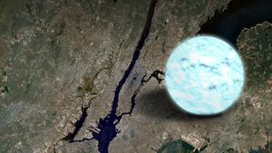

# Neutron Stars
After a [Type II Supernova](../nova/type_2_supernova.md), most of the mass of the star is ejected into space in the form of a [Supernova Remnant](../nova/supernova_remnant.md), a diffuse mass of drifting gas that slowly cools down. However, part of the remaining mass can also remain at the core in the form of a **Neutron Star**, which is one of the strangest celestial bodies that we know of.

## Core Implosion
In a Type II Supernova, the core of the massive star runs out of hydrogen, causing gravity to pull it in and crush it. This results in the fusion of heavier elements, from hydrogen, to helium, all the way to iron, at which point fusion is no longer possible. Because of this, the energy from fusion no longer can balance the force of gravity, which crushes the iron core into an extremely small volume. The rest of the surrounding plasma, similarly pulled in by the gravity, hits the core and is pushed outwards in an explosion, giving rise to the Type II Supernova.

## The Neutron Core

Just before the supernova explodes, the force from gravity grows so large that protons and electrons in the core collide, forming neutrons and neutrinos. When the supernova explodes, the shock wave originates from the plasma hitting the core and rebounding outwards, which destroys the rest of the star, leaving the core intact. The core, now comprised of neutrons, remains at the center, which is how it gets its name of neutron star.

## The Neutron Star's Bizarre Properties
Neutron stars defy logic at every turn. They have incredibly high masses, forming from the cores of stars even more massive than the Sun, but are squeezed together so tightly that their diameters are only about 20 kilometers across, the size of a city.

     A neutron star overlaid on Manhattan Island</img>

Owing to their extreme densities, neutron stars also have very strong gravitational fields, almost as strong as that of black holes. Their fields are so strong that light can bend as it passes around them, allowing us to view even the sides of neutron stars. Another property of their sheer mass is how neutron star collisions can produce gravitational waves. 

## The insides of a Neutron Star
Despite being formed from stars, neutron stars actually have a similar general structure to planets. However, with our current physics knowledge, it is difficult to predict the specifics of the internal structure of neutron stars, as their conditions are so extreme that physics as we know it could break down.

The atmosphere of neutron stars is very thin – only a few centimeters thick. The neutron star is then comprised of its crust and core; the former being mostly made from ions or atoms of iron that survived the supernova, and the latter's properties being mostly unknown. Theories for the core of neutron stars being made of a quark-gluon plasma as the neutrons dissolve into their components, or just a hyper-compressed mass of neutrons exist, but have yet to be proven.

## Finding Neutron Stars
Neutron stars were thought to exist in theory, but how could we have made sure that such extreme, strange entities really existed? The answer lies in **[pulsars](pulsar.md)**, rapidly spinning neutron stars that emit electromagnetic radiation, particularly in the radio frequencies. Recently, collisions of neutron stars producing gravitational waves have also been found, which further reinforces their existence.

Neutron stars are generally the endpoint of a star's life cycle, and do not continue to evolve. The only exception is if two neutron stars approach and collide, resulting in a huge kilonova explosion that causes fusion of the iron cores into even heavier elements such as gold, uranium and platinum from the energy of their collision. The matter is then scattered off into space, and the cycle of stellar evolution can then begin anew.

[Read more about: Pulsars](pulsar.md)

*References:*

https://www.youtube.com/watch?v=udFxKZRyQt4
https://www.nationalgeographic.com/science/article/neutron-stars
https://imagine.gsfc.nasa.gov/science/objects/neutron_stars1.html
https://www.skyatnightmagazine.com/space-science/neutron-star/
Astronomy Today 