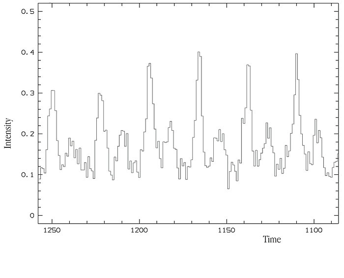
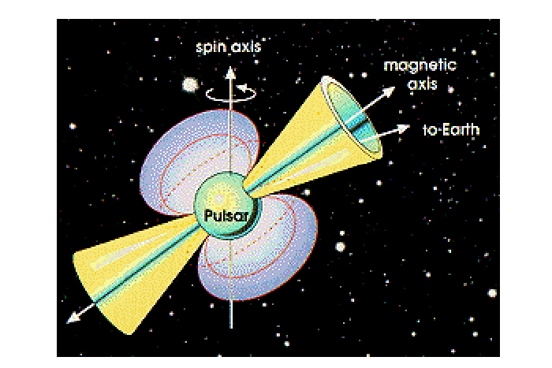

# Pulsars
**Pulsars** are stellar objects that emit pulses of electromagnetic radiation. What this means is that instead of having continuously observable radiation, the radiation arrives in bursts, with nothing observed between them. In fact, the time interval between pulses is extremely regular, regular enough to be used to keep time. 

     A graph showing the intensity of the crab pulsar over time. Note the regularly spaced peaks.

## The discovery of pulsars
The first pulsar was observed in 1967 by Jocelyn Bell. At the time, what a pulsar was was not known, which led to astronomers devising theories to model a pulsar. 

Today, we know that pulsars are spinning **[neutron stars](neutron_star.md)**; a theory first proposed by Antony Hewish, who won a share of the 1974 Nobel Prize for this discovery. Hewish deduced that the radiation profile of pulsars had to come from a spinning, small object -- a spinning object was the only explanation for the regularity of the pulses, and the small size the only way to create such sharp peaks. Today, we think of pulsars as spinning neutron stars with two spots on opposite sides radiating in a narrow cone. As the neutron star spins, these cones may sweep across Earth's surface and be detectable, allowing us to observe the pulses of the pulsar. Since the mechanism is functionally similar to how lighthouse beams flash, this model is known as the **lighthouse model**.

     A visual representation of the lighthouse model</img>

## Why do pulsars radiate?
Even now, we still do not entirely know why pulsars emit radiation in the way they do. Nevertheless, we have been able to determine some basic causes for how pulsars radiate electromagnetic radiation, namely the pulsar's fast rotation and strong magnetic field.

Neutron stars gain their extremely fast rotation due to the conservation of angular momentum — As the star collapses and the mass becomes more concentrated towards its center, its moment of inertia decreases, resulting in a corresponding increase in the angular velocity.  As the pulsar spins, its magnetic field rotates with it at high speeds. According to Faraday's Law, a changing magnetic flux (and by extension a changing magnetic field) generates an electric field. This induced electric field causes charged particles at the surface of the pulsar to be accelerated at high speeds, which then causes them to radiate.

However, this theory is still basic and fails to address different cases, for example the radiation of gamma rays by pulsars, which have a different pattern and point of emission as compared to radio waves. More intricate theories for pulsar radiation are hence still being developed.

## Pulsars and Neutron Stars
Pulsars are known to be spinning neutron stars, but they are not necessarily the only neutron stars that exist in the universe. Since the observation of a pulsar's pulses requires that the beams of electromagnetic radiation sweep across Earth, it is highly likely that for most neutron stars, Earth is not aligned with the beams to detect it, preventing us from seeing the characteristic pulses. In fact, astronomers believe that for every pulsar we observe, there are hundreds of neutron stars that we cannot observe as pulsars.

## The end of a pulsar
Nothing lasts forever, not even pulsars. As the pulsar spins and radiates, it loses its own energy in the form of radiation. This causes the magnetic field strength and the angular velocity of the pulsar to steadily decrease, which causes its radiation to get weaker, until eventually its radiation is barely detectable at all. At this point, it no longer emits the pulses characteristic of a pulsar, and remains as a regular neutron star.

*References:*

https://www.space.com/32661-pulsars.html
https://www.eso.org/public/images/eso9948i/ \
Astronomy Today