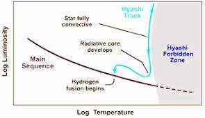
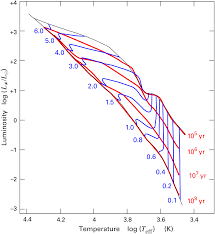

<!--Contributors: Khang, Prannaya-->
# The Hertzsprung–Russell Diagram

## Overview

</img>
Figure 1.2.1: The Combined, Labelled Hertzsprung-Russell Diagram (from <a href="https://www.eso.org/public/images/eso0728c/"><i>European Space Astronomy</i></a>)

The HR Diagram was developed years ago to represent the relationship between the Luminosity, $L$ and the Surface Temperature, $T$. Let's start by exploring the history of this diagram.

## History
{ width="300", align=right }

The HR Diagram was the brainchild of its namesake, Danish astronomer **Ejnar Hertzsprung** (1873 - 1967) and American astronomer **Henry Norris Russell** (1877 - 1957). It was developed independently by both astronomers, in 1911 and 1914 respectively.

The original HR Diagram was completely different from that pictured in [Figure 1.2.1](#fig121). It looked a lot more than what is shown below:

 
Figure 1.2.2: The Original HR Diagram (from <a href="http://spiff.rit.edu/classes/phys301/lectures/hr/hr.html"><i>Rochester Institute of Technology</i></a>)

Notice that the y-axis is the Absolute Visual Magnitude, while the x-axis is populated by letters. These are Spectral Classes. Let's get into them.

## Star Classification

### Spectral Classes

Spectral Classes are used to distinguish between different types of stars, based off color, temperature and other factors. The main factor is essentially the ionisatiom state of the star, although it can just be subtended to the surface temperature of the star. Specifically in the `Morgan-Keenan Classification System` of classification, which is the standard and was also used by both astronomers, we classify from O, B, A, F, G, K and M.

As we go down the list, the temperature of the star decreases. Often, to abbreviate, we use the following pneumonics:
- _"**O**h, **B**e **A** **F**ine **G**irl, **K** **M**e"_
- _"**O**h **B**oy, **A**n **F** **G**rade **K**ills **M**e"_
- _"**O**bama **B**ought **A** **F**reaking **G**iant **K**illing **M**achine"_

We often divide the spectral classes into 10 subdivisions, numerically from `0-9`. As this number decreases, the stars that occur become hotter. Thus, `O0` is the hottest and `M9` is the coldest.

To summarise with examples, here's a helpful table!

|Class|Color|Surface Temperature (K)|Example|Actual Class|
|-----|-----|-----|-----|-----|
|  O  |Blue |$30,000 - 60,000$|Mintaka Aa1|`O9`|
|  B  |Blue-White|$10,000 - 30,000$|Rigel|`B8`|
|  A  |White|$7500 - 10,000$|Vega (`A0`), Sirius (`A1`)||
|  F  |Yellow-White|$6000 - 7500$|Canopus|`F0`|
|  G  |Yellow|$5000 - 6000$|Sun, Alpha Centauri|`G2`|
|  K  |Orange|$3500 - 5000$|Arcturus (`K2`), Aldebaran (`K5`)||
|  M  | Red |$< 3500$|Betelgeuse (`M2`), Barnard's Star (`M5`)||

If the star is even warmer than the $60,000\text{ K}$, there is a special class known as the W class, which describes extremely hot and bluish stars known as Wolf-Rayet stars. On the other hand. Brown Dwarves are known to fall into a class lower than M.

### Luminosity Classes
The `Morgan-Keenan Classification System` also accounts for stars of specific luminosities.

|Luminosity Class|Star Type|Example|
|---|---|---|
|I|Supergiants|Betelgeuse (Red Supergiant)|
|II|Bright Giants||
|III|Giants||
|IV|Sub Giants||
|V|Main Sequence Stars|Sun|

Main Sequence is the main class where most stars fall, such as our Sun.

### Stellar Spectra (Graphs)
The following is a representation of the Stellar Spectra, broken down by the Spectral and Luminosity Classes as stated above. (Try clicking on one of the tabs, and just shifting your arrow keys. It looks quite cool!)

=== "O9V"
	

=== "B3V"
    

=== "B8V"
    

=== "A0V"
    

=== "A3V"
    
    
=== "A7V"
    

=== "F2V"
    

=== "F8V"
    

=== "G2V"
    

=== "G8V"
    

=== "K2V"
    

=== "K7V"
    
    
=== "M2V"
    

=== "M6V"
    

**Notes**:

- This data comes from the stellar spectra library described by A.J. Pickles (Proc. Ast. Soc. Pacific, 1998).
- These spectra are not displayed on a fixed intensity scale. The height of each spectrum is stretched to fill the display.
- To display a different spectrum, click a button on the left. By default, the spectrum of a G2V star like the Sun is shown.
- To measure the wavelength of a feature in the spectrum, click or click-and-drag. The wavelength is shown at the bottom of the display.
- For reference, visible light ranges from 400 to 700 nanometers. Ultraviolet is shorter in wavelength, infrared is longer.

## The Modern HR Diagram

The diagram looks as such

</img> 
Figure 1.2.3: The Actual HR Diagram

### Key Features

The Key Features of a 

The vertical axis is luminosity (in increasing order), while the horizontal axis is the temperature (in decreasing order - *for some reason*).

Most stars lie on the **main sequence**, which is the line spanning from the top left corner down to the lower right corner. 
The behavior of the main sequence stars is aptly describe by the *Stefan-Boltzmann* law, which states
$$
L = Ae\sigma T^4
$$
which illustrates the fact that stars with higher temperature (further to the left) shine brighter (higher on the vertical axis). We see that the temperature term dominates the area term as it is a power of 4, this aptly accounts for the fact that most stars are on the main sequence.

However, we do notice two deviations from the main sequence, that is for very cold stars that shines brightly and very hot stars that shines dimly. In this case, the area term is significant enough that it dominates the temperature term leading to [*giants*](../giants/red_giant.md) and [*dwarves*](../dwarves/white_dwarf.md) respectively.

## The Hayashi Track

 
The **Hayashi Track** is the almost vertical "path" that protostars (with masses less than $3 M_\odot$) take down the HR diagram. 
It represents the gravitational collapse of [T Tauri stars](../beginning/t-tauri.md), the collapsing star becomes less luminous because as the star contracts, there is less area available for the star to emit light.  
### The Forbidden Zone 💀
*Add something here later*

## The Henyey Track

 
The **Henyey Track** is a the almost horizontal "path" to the main sequence that stars take after the hayashi track, or right as they form if they have sufficient mass kickstart hydrogen fusion in their cores. Stars that enter the henyey track directly are known as [Herbig Ae/Be Stars](../beginning/herbig-ae-be.md)

