<!--Contributors: Khang, Prannaya-->
# The Hertzsprung–Russell Diagram

## Overview
<p align="center">
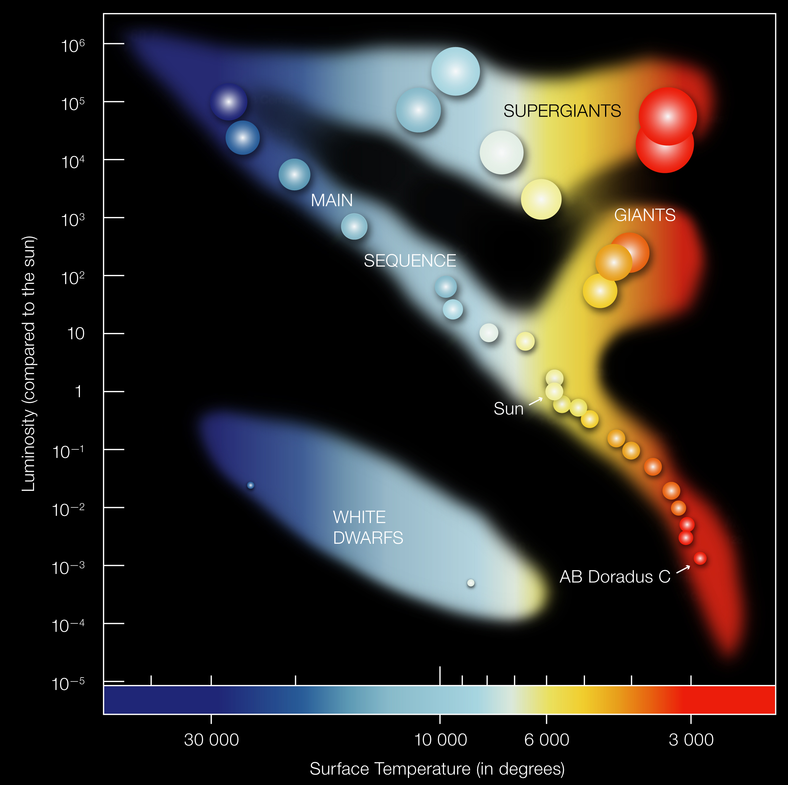</img>
<span>Figure 1.3.1: The Combined, Labelled Hertzsprung-Russell Diagram<br>(from <a href="https://www.eso.org/public/images/eso0728c/"><i>European Space Astronomy</i></a>)</span>
</p>

The HR Diagram was developed years ago to represent the relationship between the Luminosity, $L$ and the Surface Temperature, $T$. Let's start by exploring the history of this diagram.

## History
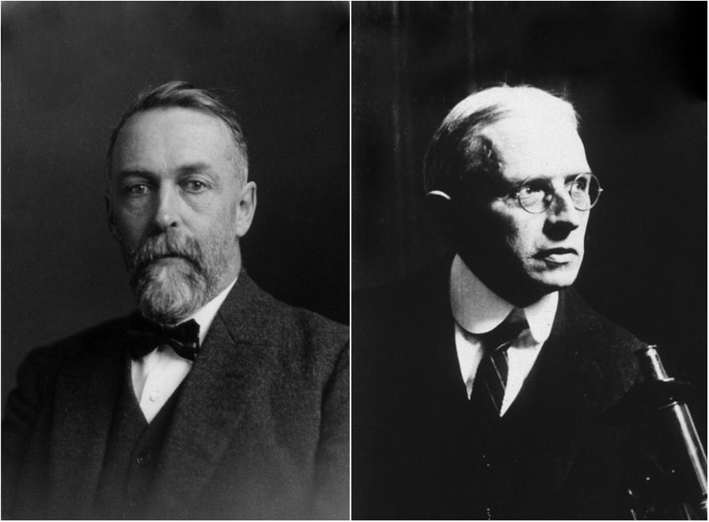{ width="300", align=right }

The HR Diagram was the brainchild of its namesake, Danish astronomer **Ejnar Hertzsprung** (1873 - 1967) and American astronomer **Henry Norris Russell** (1877 - 1957). It was developed independently by both astronomers, in 1911 and 1914 respectively.

The original HR Diagram was completely different from that pictured in [Figure 1.3.1](#fig121). It looked a lot more like what is shown below:

<p align = "center" id = "fig122">
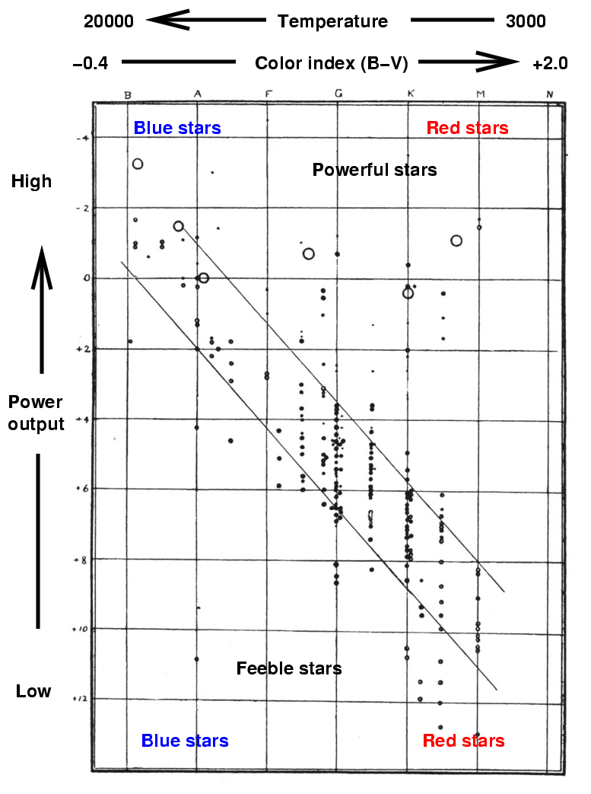<br>
<span>Figure 1.3.2: The Original HR Diagram<br>(from <a href="http://spiff.rit.edu/classes/phys301/lectures/hr/hr.html"><i>Rochester Institute of Technology</i></a>)</span>
</p>

Notice that the y-axis is the Absolute Visual Magnitude, while the x-axis is populated by letters. These are Spectral Classes, which I've left as optional reading down below:

??? Abstract "More about Star Classification"
    ## Star Classification

    ### Spectral Classes

    Spectral Classes are used to distinguish between different types of stars, based off color, temperature and other factors. The main factor is essentially the ionisatiom state of the star, although it can just be subtended to the surface temperature of the star. Specifically in the `Morgan-Keenan Classification System` of classification, which is the standard and was also used by both astronomers, we classify from O, B, A, F, G, K and M.

    As we go down the list, the temperature of the star decreases. Often, to abbreviate, we use the following pneumonics:

    - _"**O**h, **B**e **A** **F**ine **G**irl, **K**iss **M**e"_
    - _"**O**h **B**oy, **A**n **F** **G**rade **K**ills **M**e"_
    - _"**O**bama **B**ought **A** **F**reaking **G**iant **K**illing **M**achine"_

    We often divide the spectral classes into 10 subdivisions, numerically from `0-9`. As this number decreases, the stars that occur become hotter. Thus, `O0` is the hottest and `M9` is the coldest.

    To summarise with examples, here's a helpful table!

    |Class|Color|Surface Temperature (K)|Example|Actual Class|
    |-----|-----|-----|-----|-----|
    |  O  |Blue |$30,000 - 60,000$|[Mintaka Aa1](https://en.wikipedia.org/wiki/Mintaka)|`O9`|
    |  B  |Blue-White|$10,000 - 30,000$|[Rigel](https://en.wikipedia.org/wiki/Rigel)|`B8`|
    |  A  |White|$7500 - 10,000$|[Vega](https://en.wikipedia.org/wiki/Vega) (`A0`), [Sirius](https://en.wikipedia.org/wiki/Sirius) (`A1`)||
    |  F  |Yellow-White|$6000 - 7500$|[Canopus](https://en.wikipedia.org/wiki/Canopus)|`F0`|
    |  G  |Yellow|$5000 - 6000$|Sun, [Alpha Centauri](https://en.wikipedia.org/wiki/Alpha_Centauri)|`G2`|
    |  K  |Orange|$3500 - 5000$|[Arcturus](https://en.wikipedia.org/wiki/Arcturus) (`K2`), [Aldebaran](https://en.wikipedia.org/wiki/Aldebaran) (`K5`)||
    |  M  | Red |$< 3500$|Betelgeuse (`M2`), Barnard's Star (`M5`)||

    If the star is even warmer than the $60,000\text{ K}$, there is a special class known as the W class, which describes extremely hot and bluish stars known as Wolf-Rayet stars. On the other hand. Brown Dwarves are known to fall into a class lower than M.

    ### Luminosity Classes
    The `Morgan-Keenan Classification System` also accounts for stars of specific luminosities.

    |Luminosity Class|Star Type|Example|
    |---|---|---|
    |I|Supergiants|Betelgeuse<br>(Red Supergiant)|
    |II|Bright Giants||
    |III|Giants||
    |IV|Sub Giants||
    |V|Main Sequence Stars|Sun|

    Main Sequence is the main class where most stars fall, such as our Sun.

    ### Stellar Spectra (Graphs)
    The following is a representation of the Stellar Spectra, broken down by the Spectral and Luminosity Classes as stated above. (Try clicking on one of the tabs, and just shifting your arrow keys. It looks quite cool!)


    === "O9V"
        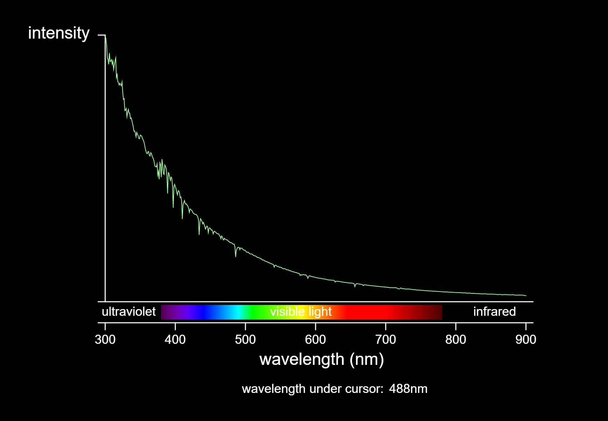

    === "B3V"
        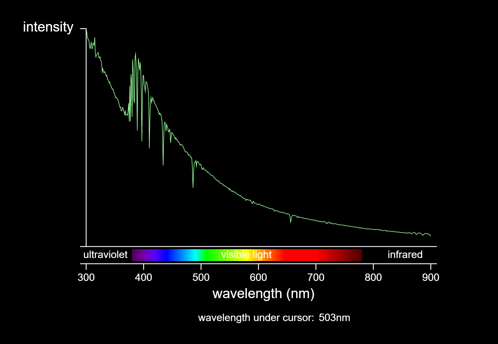

    === "B8V"
        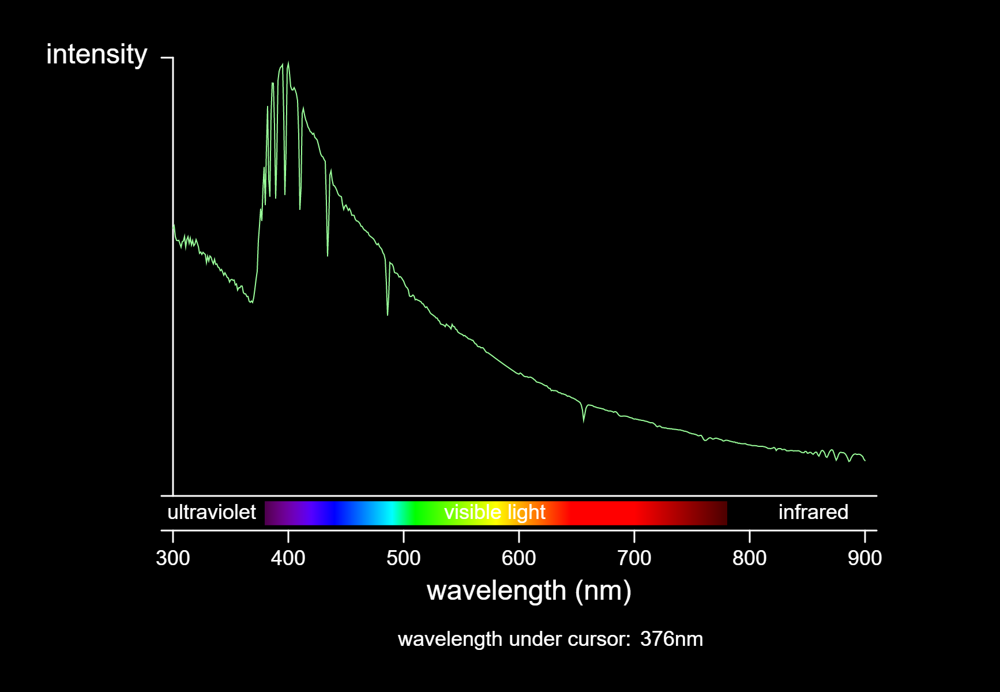

    === "A0V"
        

    === "A3V"
        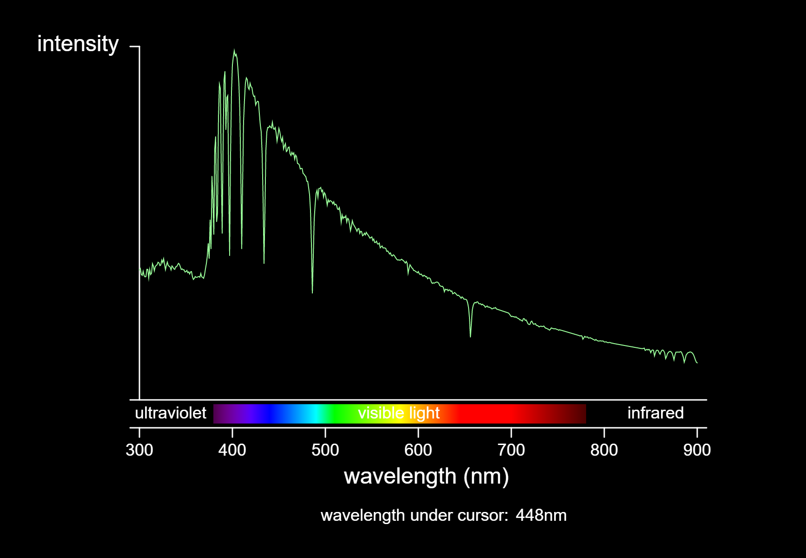
        
    === "A7V"
        

    === "F2V"
        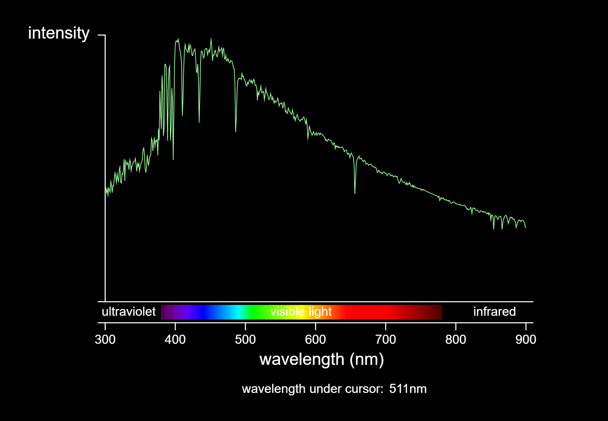

    === "F8V"
        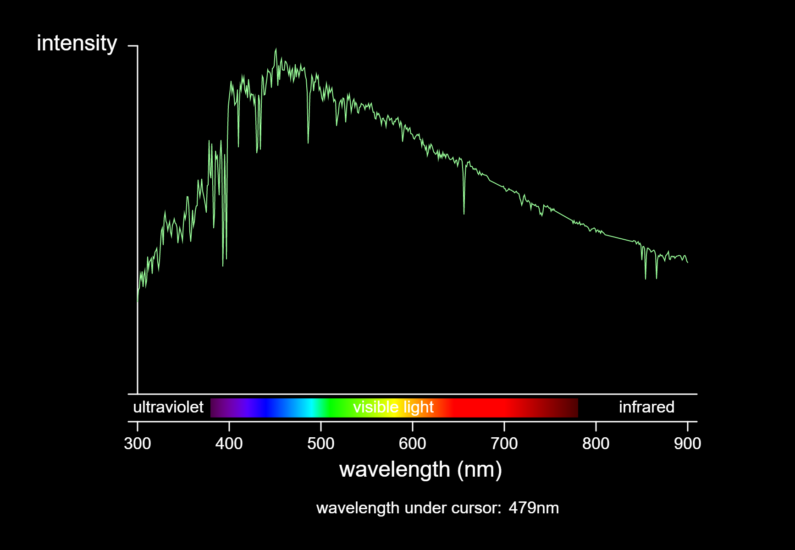

    === "G2V"
        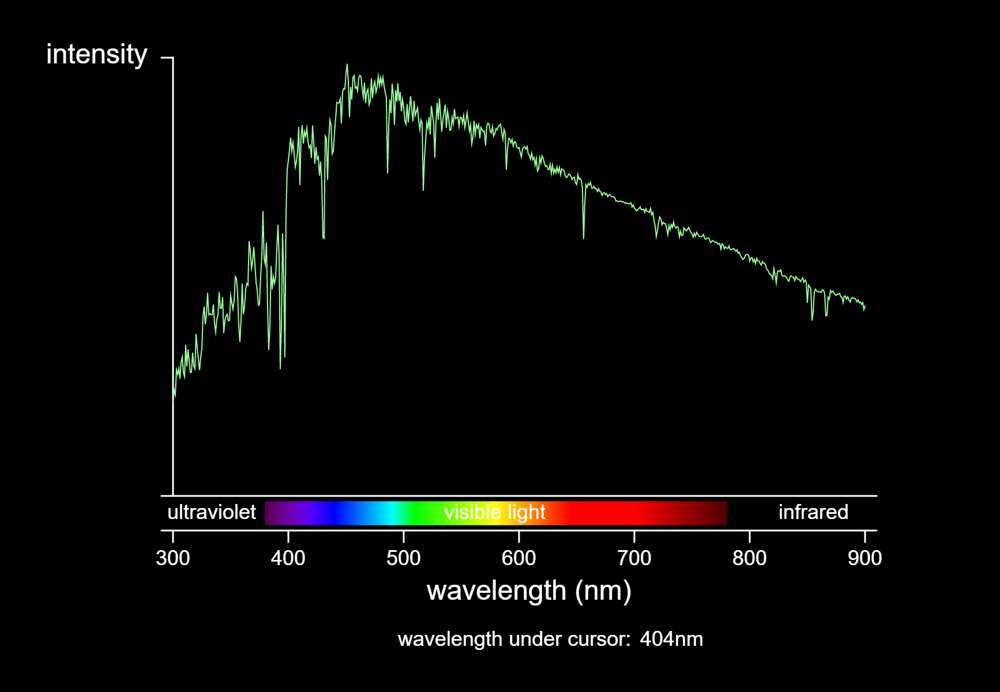

    === "G8V"
        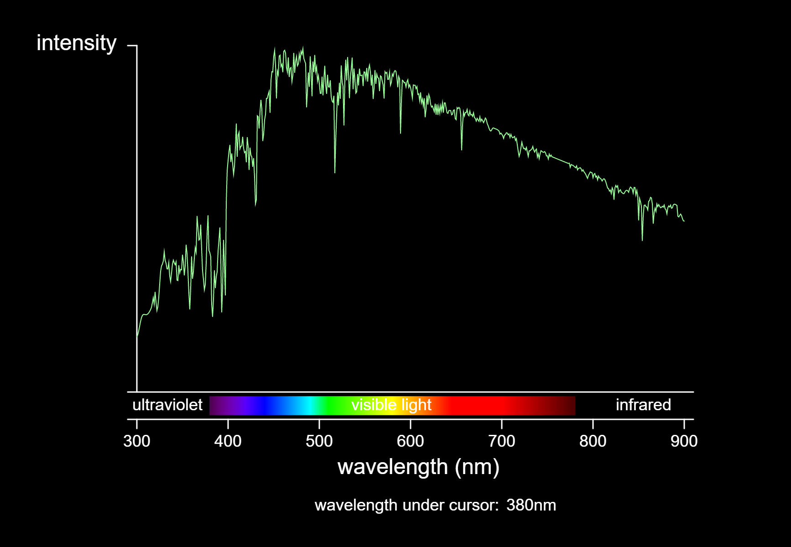

    === "K2V"
        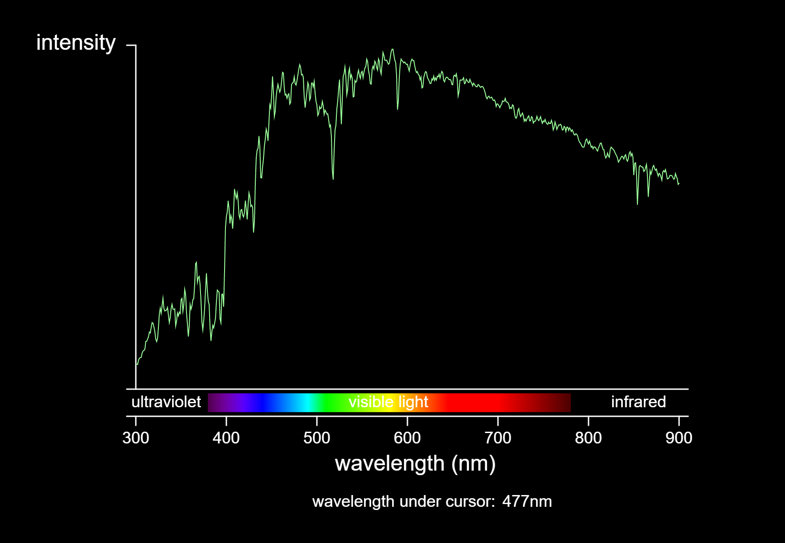

    === "K7V"
        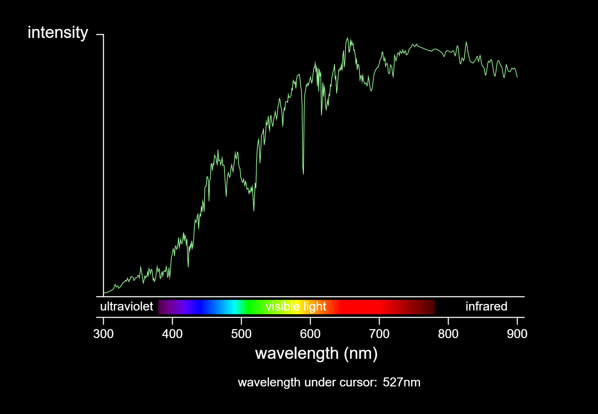
        
    === "M2V"
        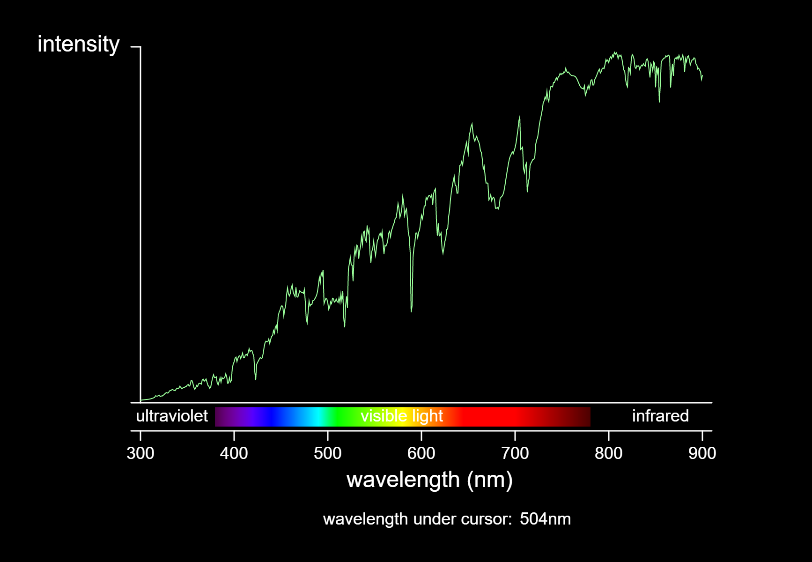

    === "M6V"
        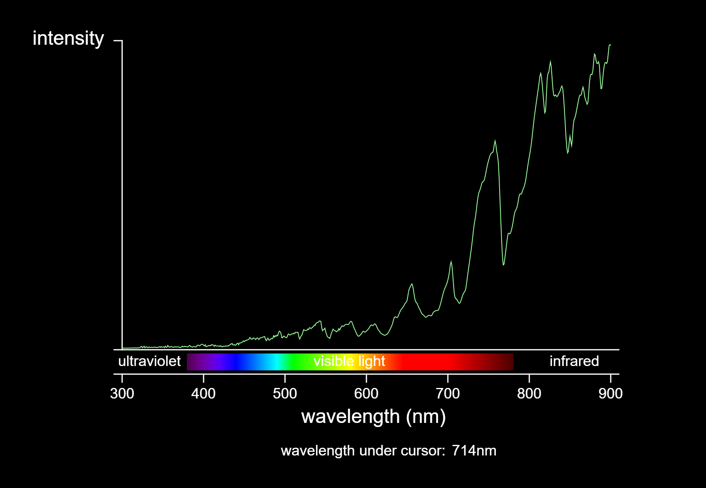


    **Notes**:

    - This data comes from the stellar spectra library described by A.J. Pickles (Proc. Ast. Soc. Pacific, 1998).
    - These spectra are not displayed on a fixed intensity scale. The height of each spectrum is stretched to fill the display.
    - To display a different spectrum, click a button on the left. By default, the spectrum of a G2V star like the Sun is shown.
    - To measure the wavelength of a feature in the spectrum, click or click-and-drag. The wavelength is shown at the bottom of the display.
    - For reference, visible light ranges from 400 to 700 nanometers. Ultraviolet is shorter in wavelength, infrared is longer.

## The Modern HR Diagram

The diagram looks as such
<p align="center">
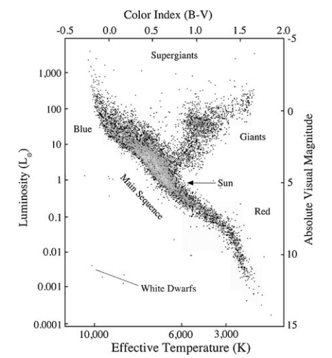</img><br>
<span>Figure 1.3.3: The Actual HR Diagram<br><i>(From the ESA/HIPPARCOS Mission)</i></span>
</p>

### Key Features

The Key Features of the HR Diagram is as follows:

- Vertical Axis is some variant of the Luminosity, $L$ or Absolute Visual Magnitude, $M$. <br><sub>(As we learnt in [The Magnitude Scale](../magnitude_scale), Absolute Visual Magnitude is a scaled form of $\log L$.)</sub>
- Horizontal Axis is Temperature, but **note**, the axis is flipped. This means that as we go the right of the diagram, the temperature is in fact decreasing.

The shape on the graph is largely predicated on what stars you identify, but most stars, as mentioned before, fall into the **main sequence**, the long line spanning the top left to bottom right of the graph. For the sake of this discussion, let's briefly go through each type of star.

### Main Sequence

The behaviour of the main sequence stars is described by the **Stefan-Boltzmann Law**, $L = Ae\sigma T^4$. To illustrate this relation,  here is a diagram I've plotted:

<p align = "center">
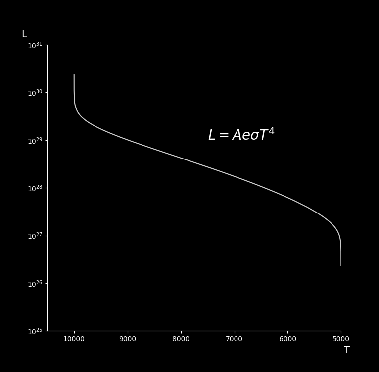<br>
<span>Figure 1.3.4: A plot of the possible pattern of main sequence stars.</span>
</p>

??? Abstract "Code Used to Create the Plot above"

    ```python
    # Plot of Main Sequence Stars

    import numpy as np
    import matplotlib.pyplot as plt

    from matplotlib.figure import Figure
    from matplotlib import image
    from matplotlib.offsetbox import OffsetImage, AnnotationBbox

    plt.rcParams['axes.facecolor']='black'
    plt.rcParams['savefig.facecolor']='black'

    T = np.linspace(5000, 10000, 1000000)
    sigma = 5.67e-8
    R = np.sort(2**np.random.normal(0, 0.5, 1000000)) * 6.9634e9


    L = np.pi * R**2 * sigma * T**4

    # Initialize Subplots
    fig, ax = plt.subplots(figsize=(10, 10), facecolor = "black")

    # Plot Axes
    ax.plot(T, L, c = "white", alpha = 0.8)


    # Remove top and right spines
    ax.spines['top'].set_visible(False)
    ax.spines['right'].set_visible(False)

    # Set Everything as White
    ax.spines['bottom'].set_color('white')
    ax.spines['left'].set_color('white')
    ax.xaxis.label.set_color('white')
    ax.yaxis.label.set_color('white')
    ax.tick_params(axis='x', colors='white')
    ax.tick_params(axis='y', colors='white')


    # Create 'x' and 'y' labels
    ax.set_xlabel('T', size = 14, x = 1.02)
    ax.set_ylabel('L', size = 14, rotation = 0, y = 1.02, x = 0)
    ax.set(xlim = (5000, 10500), ylim=(1e25, 1e31))
    ax.invert_xaxis()
    ax.set_yscale('log')

    # Set bottom and left spines as x and y axes of coordinate system
    ax.spines['bottom'].set_position(('data', 1e25))
    ax.spines['left'].set_position(('data', 10500))

    # Draw arrows
    arrow_fmt = dict(markersize=4, color='white', clip_on=False)
    ax.plot((1), (0), marker='>', transform=ax.get_yaxis_transform(), **arrow_fmt)
    ax.plot((0), (1), marker='^', transform=ax.get_xaxis_transform(), **arrow_fmt)


    ax.text(7500, 1e29, "$L = Ae\sigma T^4$", color = "white", fontsize=20)

    plt.show()
    ```

Of course, you can always relate it to the star's nuclear output, which is governed by Einstein's most famous equation,

$$E = mc^2$$

This means that a more massive star has a higher radioactive output, which means that the mass has a significant effect on this situation as well. Stars often spend billions and billions of years in this class, before it moves on to others.

#### Pre-Main Sequence
Pre-Main Sequence Stars tend to follow two different tracks to enter on their journey, the **Henyey and Hayashi Tracks**.

To represent them as a diagram, here is a good depiction:

<p align = "center">
<figure markdown>


  <figcaption>Figure 1.3.5: Main Sequence stars often follow the above path in evolution.<br><i>Source: Wikipedia</i></figcaption>
</figure>
</p>

##### The Hayashi Track
<p align = "center">
<figure markdown>
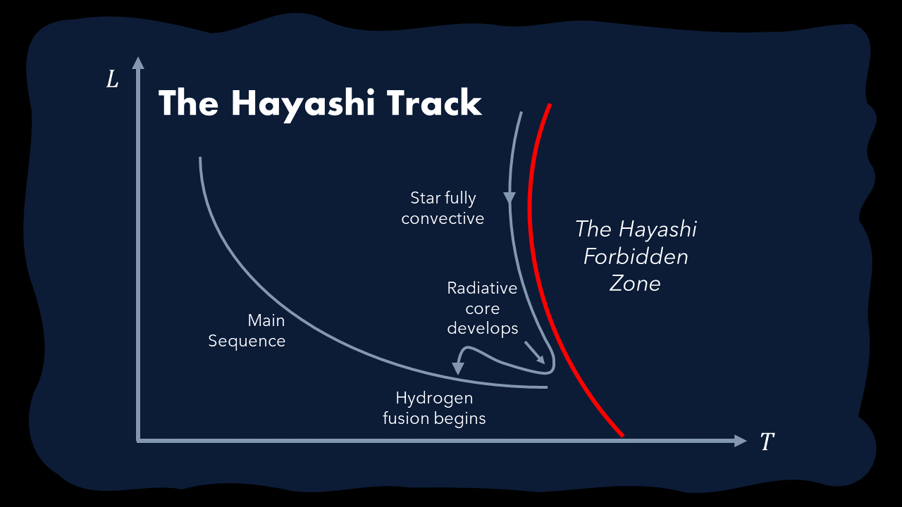
  <figcaption>Figure 1.3.6: A depiction of the Hayashi Track as taken by the T Tauri stars.</figcaption>
</figure>
</p>

The **Hayashi Track** is the almost vertical "path" that protostars (with masses less than $3 M_\odot$) take down the HR diagram, representing the gravitational collapse of [T Tauri stars](../../beginning/t-tauri), wherein the collapsing star becomes less luminous due to a decreasing surface area.

##### The Henyey Track
The **Henyey Track** is a the nearly horizontal "path" to the main sequence that stars take after the Hayashi track, or right as they form if they have sufficient mass to kickstart hydrogen fusion in their cores (e.g. [Herbig Ae/Be Stars](../../beginning/herbig-ae-be)). This is when the nuclear fusion has just started and the star is slowly collapsing in order to reach hydrostatic equilibrium. Throughout this, the star becomes hotter, even whilst staying at a consistent luminosity.


### Giants and Supergiants

Giants and Supergiants often tend to be red in color, which usually means their temperatures are very low. However, due to their relatively larger sizes and radii, they shine much, **much** brighter than even some blue main sequence stars. [As we will later learn](../../giants/red_giant), giants are mostly formed long after a star enters main sequence, and are in fact vaguely visible via the naked eye, which means a large proportion of stars we see in the sky are in fact red giants.

### Dwarves

Dwarves don't commonly occur, since the universe isn't old enough for such dwarves to have been formed in large majority. However, their characteristic abnormality is their lowly radiative luminosity given their high temperatures. We will read more about dwarves [later](../../dwarves/white_dwarf).


??? Abstract "Optional Reading"

    ## Key Variations of the Diagram

    **Quick Note**: This section is largely adapted based on work done by some of the team members for the Astrochallenge 2022 Data Analysis Question.

    ### Color Magnitude Diagrams

    Color Magnitude Diagrams are another way of approaching HR Diagrams. They are slightly varied, for instance using Magnitude instead of Luminosity, and "Color" instead of Temperature.

    <p align = "center">
    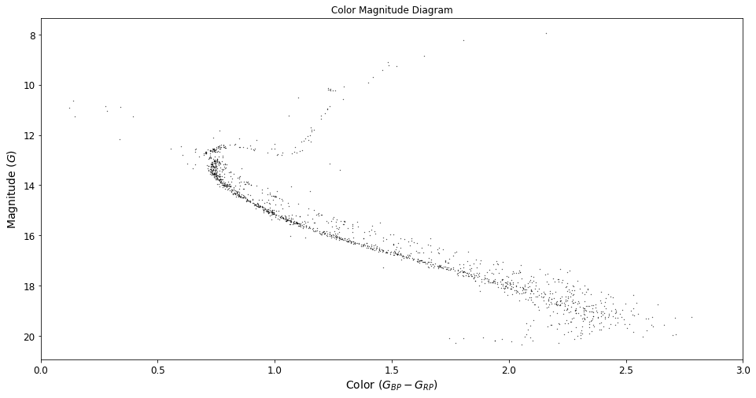<br>
    <span>Figure 1.3.5: A Color Magnitude Diagram based on the Data from the Gaia Early Data Release 3 (eDR3), specifically pertaining to the M67 Cluster as obtained via the HDBScan algorithm<br><i>(Data Courtesy of the Gaia Early Data Release 3)</i></span>
    </p>


    As you can see, most of the features commonly associated with the HR Diagram, like the Supergiants and Dwarves and more, are missing, but why?

    This is mainly caused by the fact that M67 is a cluster that holds mostly stars that would have been created via the same molecular cloud. This means that their compositions and sizes are likely to be the same, other than perhaps some stars that have slowly edges towards giants, causing a slight movement. However, something that was strangely found was that if you actually obtained the entire Color Magnitude Diagram in the direction of M67, we would get a huge, HUGE patch underneath the main sequence line.

    <p align = "center">
    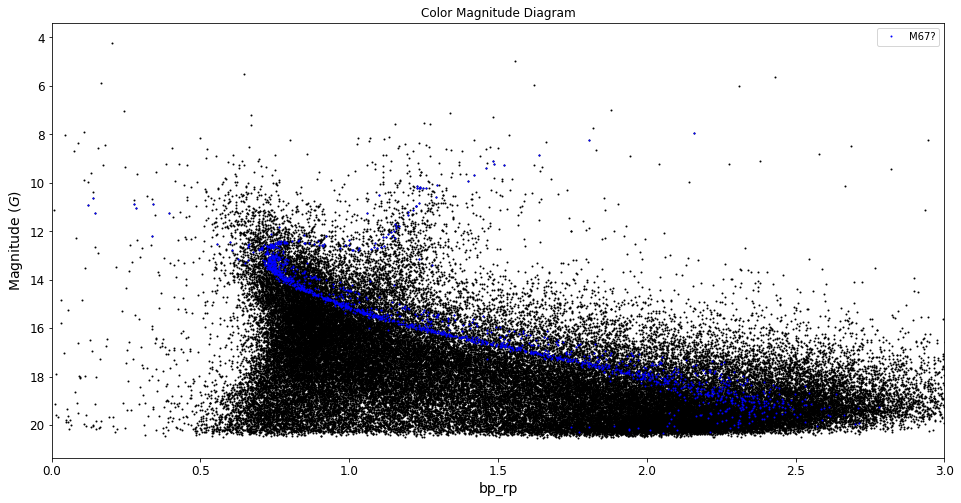<br>
    <span>Figure 1.3.6: The Actual Color Magnitude Diagram based on the Data from the Gaia Early Data Release 3 (eDR3), in the direction of the M67 Cluster. Highlighted in Blue is the M67 Color Magnitude Diagram as in Figure 1.3.5<br><i>(Data Courtesy of the Gaia Early Data Release 3)</i></span>
    </p>

    The reason for this is that not all of these are moving away at precisely the same speeds, whereas based on our current understanding of cosmology, the cluster itself moves slowly but roughly at the same speed away from us. This was in fact how we obtained the M67 cluster from the data, which is pretty cool.


### The XKCD Cut

[Randall Munroe](https://en.wikipedia.org/wiki/Randall_Munroe) from [XKCD](https://xkcd.com) developed an amazing image illustrating an "expanded" version on the HR Diagram in Figure 1.3.1. See below:

<p align = "center">
    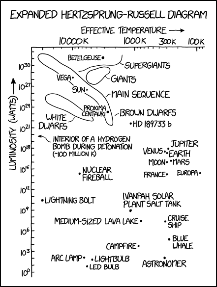<br>
    <span>Figure 1.3.7: The "Expanded" Hertzprung Russell Diagram :smile:<br><i>(Brought to you by <a href="https://xkcd.com/2009/">XKCD</a>)</i></span>
</p>


## A Final Quiz
<script>
function markQ1(answer) {
    if(answer == 8) {
        document.getElementById("q1_9").classList.add("quizCorrect")
        let wrong = [1, 2, 3, 4, 5, 6, 7, 8]
        for(i of wrong) {
            document.getElementById(`q1_${i}`).classList.add("quizIncorrect")
        }
        document.getElementById("q1_exp").style.visibility = "visible";
    } else {
        document.getElementById(`q1_${answer+1}`).classList.add("quizIncorrect")
    }
}

function markQ2(answer) {
    if(answer == 1) {
        document.getElementById("q2_2").classList.add("quizCorrect")
        let wrong = [1, 3, 4]
        for(i of wrong) {
            document.getElementById(`q2_${i}`).classList.add("quizIncorrect")
        }
        document.getElementById("q2_exp").style.visibility = "visible";
    } else {
        document.getElementById(`q2_${answer+1}`).classList.add("quizIncorrect")
    }
}
</script>

!!! Question "If Betelgeuse were placed further away from Earth, what would happen to its position on the HR Diagram?"
	<div align="center">
	<button class='md-button quizNormal' id="q1_1" onClick="markQ1(0)">North</button>
	<button class='md-button quizNormal' id="q1_2" onClick="markQ1(1)">Northeast</button>
	<button class='md-button quizNormal' id="q1_3" onClick="markQ1(2)">East</button>
	<button class='md-button quizNormal' id="q1_4" onClick="markQ1(3)">Southeast</button><br><br>
	<button class='md-button quizNormal' id="q1_5" onClick="markQ1(4)">South</button>
	<button class='md-button quizNormal' id="q1_6" onClick="markQ1(5)">Southwest</button>
	<button class='md-button quizNormal' id="q1_7" onClick="markQ1(6)">West</button>
	<button class='md-button quizNormal' id="q1_8" onClick="markQ1(7)">Northwest</button><br><br>
	<button class='md-button quizNormal' id="q1_9" onClick="markQ1(8)">No Change</button>
	<hr>
    <p class="quizExplanation invisible" id="q1_exp">There is <b>NO CHANGE</b>, because the distance from earth does not make any difference on the Absolute Visual Magnitude as it isn't affected by distance at all.</p>
	</div>

!!! Question "What are the stars that enter the Henyey Track pretty much immediately?"
	<div align="center">
	<button class='md-button quizNormal' id="q2_1" onClick="markQ2(0)">T-Tauri Stars</button>
	<button class='md-button quizNormal' id="q2_2" onClick="markQ2(1)">Herbig Ae/Be Stars</button>
	<button class='md-button quizNormal' id="q2_3" onClick="markQ2(2)">Protostars</button>
	<button class='md-button quizNormal' id="q2_4" onClick="markQ2(3)">Brown Dwarves</button>
	<hr>
    <p class="quizExplanation invisible" id="q2_exp">The Herbig Ae/Be stars are the only stars with enough mass to kickstart hydrogen fusion in their cores.</p>
	</div>

