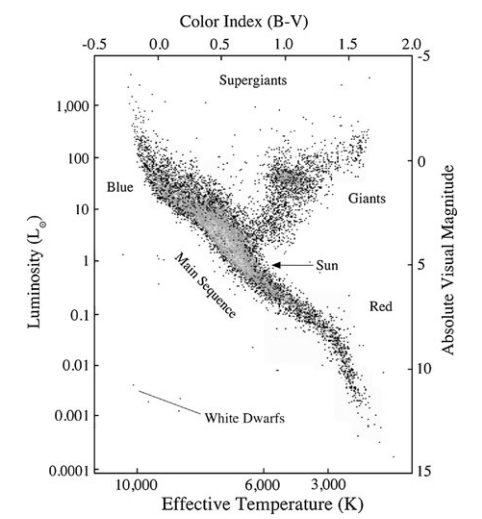

<!--Contributors: Khang-->
# The Hertzsprung–Russell Diagram

It is a diagram that illustrates the change in luminosity vs. temperature. Its called the Hertzsprung-Russell diagram because it was "discovered" independently by Danish astronomer Ejnar Hertzsprung and American astronomer Henry Norris Russell.

The diagram looks as such 
{align=center}  
The vertical axis is luminosity (in increasing order), while the horizontal axis is the temperature (in decreasing order - *for some reason*).

Most stars lie on the **main sequence**, which is the line spanning from the top left corner down to the lower right corner. 
The behavior of the main sequence stars is aptly describe by the *Stefan-Boltzmann* law, which states
$$
L = Ae\sigma T^4
$$
which illustrates the fact that stars with higher temperature (further to the left) shine brighter (higher on the vertical axis). We see that the temperature term dominates the area term as it is a power of 4, this aptly accounts for the fact that most stars are on the main sequence.

However, we do notice two deviations from the main sequence, that is for very cold stars that shines brightly and very hot stars that shines dimly. In this case, the area term is significant enough that it dominates the temperature term leading to [*giants*](../giants/red_giant.md) and [*dwarves*](../dwarves/white_dwarf.md) respectively.

## The Hayashi Track

 
The **Hayashi Track** is the almost vertical "path" that protostars (with masses less than $3 M_\odot$) take down the HR diagram. 
It represents the gravitational collapse of [T Tauri stars](../beginning/t-tauri.md), the collapsing star becomes less luminous because as the star contracts, there is less area available for the star to emit light.  
### The Forbidden Zone 💀
*Add something here later*

## The Henyey Track

 
The **Henyey Track** is a the almost horizontal "path" to the main sequence that stars take after the hayashi track, or right as they form if they have sufficient mass kickstart hydrogen fusion in their cores. Stars that enter the henyey track directly are known as [Herbig Ae/Be Stars](../beginning/herbig-ae-be.md)

