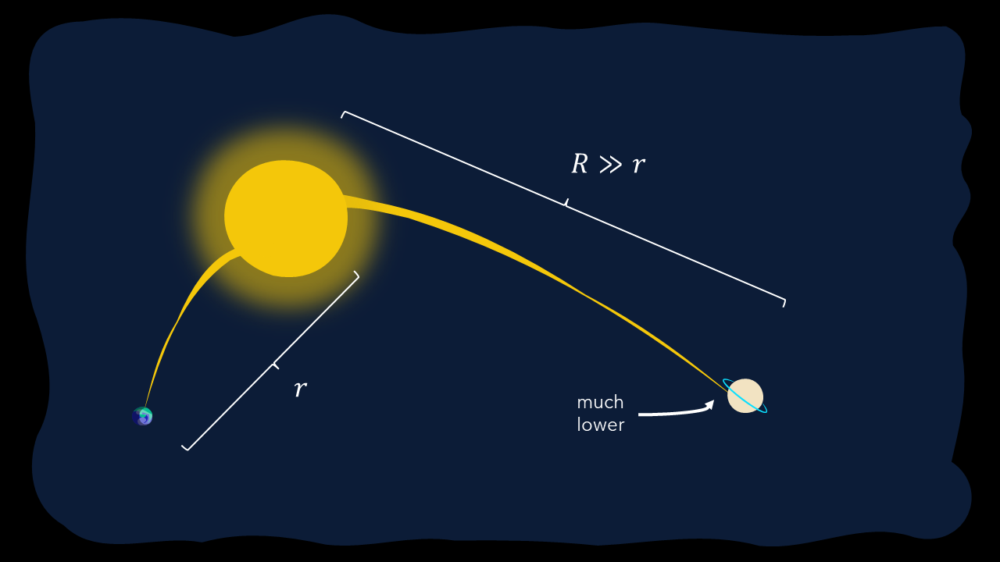
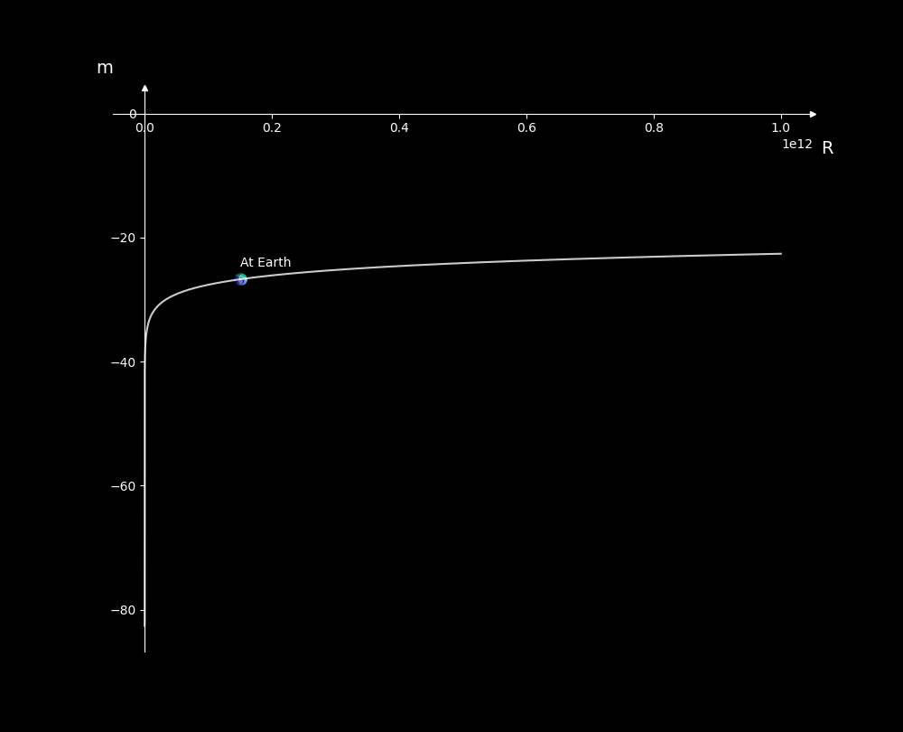
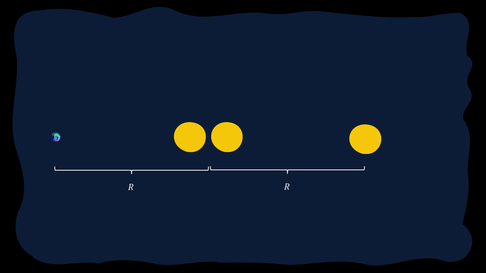

# Magnitude Scale

This is a brief overview of the Magnitude Scale system before we move on to the classification of stars.

The understand the Magnitude System, we must first start by discussing the historical significance of the system.

## Hipparchus and the Greek Observation

{ width="150", align=right }

Hipparchus of Nicea (190 BC - 120 BC) was one of the many astronomers in the time of the Greeks, and influenced much of what we understand of astronomy today. What sets him apart is he is still considered, to this date, the greatest astronomical observer in history. His work on star catalogs, spherical trigonometry and more still astounds astronomers working today, but what we want to focus on today is his work on the Magnitude Scale.

Prior to Hipparchus, most Greek astronomers believed that a star's brightness is only based on its size, which we now know is in fact false. There are many factors in play here, and we needed to spend more time analysing it.

Then Hipparchus himself came to the scene. As perhaps the greatest anicient astronomer, he used his ingenuity to group stars up into specific classes based on their perceived brightness. He assigned discrete integer values to each star, such that the brightest stars would fall into the _"Stars of the First Magnitude"_ and the barely visible stars were allocated to the _"Stars of the Sixth Magnitude"_.

The problem with this system was unfortunately the fact that just plain observation is incredibly subjective, since stars often vary in brightness. However, this set the seedling for what was yet to come...

## Norman Pogson

{ width="150", align=right }

In 1856, an Astronomer working at Oxford University by the name of Norman Pogson came up with an efficient scale to work with the preset definitions from Hipparchus.

He believed that our observation and hence tabulation of the magnitudes of different stars was influenced by a Logarithmic Scale. However, it wasn't purely based on a logarithmic scale in the conventional sense. Scaling and done to ensure that a simple step-down of 5 steps of magnitude would entail the star being about a **hundred** times brighter. To visualise, it would be something like this:

$$
\frac{F}{F_\text{ref}} = 100^{(m_\text{ref} - m)/5}
$$

or in other words:

$$
m = m_\text{ref} + 2.5 \log \left(\frac{F_\text{ref}}{F}\right)
$$

Where we have that $F$ and $m$ are the flux (as intensity) and magnitude (as a decimal value). We have to base it off the referential object, reprsented by the $\text{ref}$ keyword.

This is known as **Pogson's Law**, an incredibly important theorem in the field of stellar astronomy and observational astronomy. We can use this for comparisons between different variables or simply for identifying the magnitude/flux of the object to be observed. Ideally, if the value of $m$ is larger than 6, we can just say that the object is invisible in the night sky via the use of the naked eye, although using traditional telescopes or even high-powered space-based observatories like the Hubble Space Telescope (HST) and the James Webb Space Telescope (JWST), we can identify much, **MUCH** fainter stars, which is truly extraordinary.

Noticeably, this result can be simplfied by essentially modifying to base of the exponent to be $100^{1/5} \approx 2.512$ instead of just $100$. Generally however, sticking to $100$ is better for achieving a value closer to the actual value. However

## Reference Points

For the most part, astronomers used to use Polaris (the North Star) as a reference, defining its magnitude as about $+2.0$. However, it was later found that Polaris was a variable star, which essentially means that its brightness would vary with time.

We eventually moved to Vega, another star whose brightness was believed to be about $+0.0$ (the actual value was in fact $+0.026$). However, recent studies have shown that Vega is also variable, although we have not yet identified the next best reference point.

However, for a better compilation, we can list the following samples:

|Reference Point|Reference $m$|Reference Point|Reference $m$|
|---|---|---|---|
|Sun|-26.74|Full Moon|-12.7|
|Venus|-4.5|Jupiter|-2.5|
|Saturn|+0.7|Sirius|-1.46|
|Canopus|-0.72|Alpha Centauri|-0.01|
|Arcturus|-0.04|Vega|+0.026|
|Capella|+0.08|Rigel|+0.18|
|Procyon|+0.34|Achernar|+0.50|Betelgeuse|+0.42|
|Polaris|+1.97|||{align="right"}

Looking through this expansive list, we are able to identify some key sources. We have the brightest planets in the night sky, namely Venus, Jupiter and Saturn. Sirius is the brightest star in the night sky, and Alpha Centauri is the closest star to our solar system beyond, of course, our Sun.

## The Fundamental Flaw with $m$

As you've seen, we've used $m$ here to represent the visual magnitude, but this is in fact the **apparent** visual magnitude. The readings in the above system only match up based on a specifc common origin, which in this case is the earth. However, at other points, this same visual perception would be vastly different. For a simple set-up, consider viewing the Sun from the Earth and Saturn, as shown in the diagram below.

</img>
Figure 1.1: Comparison of Luminosities of the Sun from Earth and Saturn

It is a noticeable difference, and it is also apparent in the values for $F$. Based on our understanding of flux intensity, we have the following:

$$
F = \frac{P}{A} = \frac{L}{4\pi R^2}
$$

This means that at further distances, the flux decreases. Hence the value for $m$ at Saturn will **NOT** be $-26.74$.

This poses an important issue in the face of astronomers, and they have come up with two different ways to fix this, namely the following:

1. **Scaling** based on Distance
2. Establishing a **Universal Standard**

Let's cover both of them.

## Relating to Distance

Considering the same flux equation above, we can easily extrapolate the following relation for the same star from varied distances:

$$
\begin{align*}
F_1 &= \frac{L}{4\pi R_1^2} \\
F_2 &= \frac{L}{4\pi R_2^2} \\
\frac{F_1}{F_2} &= 100^{(m_2 - m_1)/5} \\
\frac{\frac{L}{4\pi R_1^2}}{\frac{L}{4\pi R_2^2}} &= 100^{(m_2 - m_1)/5} \\
\frac{R_2}{R_1} &= 10^{(m_2 - m_1)/5} \\
m_2 - m_1 &= 5 \log \left(\frac{R_2}{R_1} \right)
\end{align*}
$$

This can be used easily to scale the magnitude. For instance, if the object is brought ten times closer, the new magnitude is 5 times larger. We also see that magnitude increases with increases distance, so for some arbitrary point. It follows the following graph:

</img>
Figure 1.2: Plot of m as it varies with R (Reference Point is the Sun)

## Establishing a Universal Standard: The Absolute Magnitude

Another general solution was [later established](https://articles.adsabs.harvard.edu/cgi-bin/nph-iarticle_query?2006JAHH....9..173H&defaultprint=YES&filetype=.pdf), which introduced a universal standard known as the **Absolute Magnitude**. This system was defined based on a referential distance, that is to say that the absolute magnitude, $M$ would occur at that specific distance from any given object. This distance was **10 parsecs**. For the sake of this context, let a parsec ($\text{pc}$) be a given unit of measurement, similar to a lightyear or AU. By definition, $1\text{ pc} = 3.086 \times 10^{16}\text{ m} = 3.262\text{ ly}$. Hence we had the following equation:

$$m - M = 5 \log \left(\frac{R}{10 \text{ pc} } \right)$$

Of course, if this wasn't enough, Astronmers have an interesting term for the Left-Hand Side of the above Equation, $\mu = m - M$. This value is known as the _distance modulus_, since it is only really affected by the distance from the given object.

We often use $M$ instead so that we can get an accurate perception of a given star, and this comes in handy with stellar evolution.

Notably, if we were to represent $R$ in parsecs, we have the following:

$$M = m + 5 - 5\log R$$

This is useful since the distance in parsecs is also known as the *parallax* of any given object, $\pi$. Hence,

$$M = m + 5 - 5\log \pi$$

For instance, the absolute magnitude of the Sun is given by $+4.83$.

## Fun Questions

!!! Question "A Triple Star System"

    === "Question"

        A Triple Star System is defined for where three stars move around another in a consistent eclipse. Most stable triple star systems involve a faraway star influencing an eclipsing binary star system. Let's assume, for the sake of this discussion, that this oscillating system is observed in the eclipsing pattern, that is to say that they move along a singular planar line with reference from the earth.

        Thus, while in reality, the situation is very much as shown in the below image:

        

        However, from Earth, the view would be more so as shown in the diagram below:

        

        Assuming that these are identical stars and hence emit identical luminosities, and assuming that the nearest point for the independent teritiary or the binary star system (which you can treat as a singular entity) is given by a distance variable $R$, and the radius of the circular orbit is of radius $\frac{R}{2}$, derive the magnitudes of the Eclipsing Binary (EB) and Tertiary Candidate (TC) when:

        <ol type = "a">
        <li>the tertiary candidate is furthest.</li>
        <li>the tertiary candidate is closest.</li>
        <li>the tertiary candidate and eclipsing binary are equidistant from the Earth</li>
        </ol>

        Assume that for overlap, no light is blocked (unrealistic circumstance).

        Leave your answer in terms of the absolute magnitude of any one of the given stars, $M$, and $R$.

    === "Solution (a)"

        For Part (a), let's visualise the solution as below:
        

        This is a pretty interesting solution. First, let's start by obtaining the visual magnitude of the tertiary candidate (TC) and the eclipsing binary (EB).

        $$
        \begin{align*}
        m_\text{TC} &= M_\text{TC} + 5 \log \left(\frac{2R}{10 \text{ pc} } \right) \\
        m_\text{EB} &= M_\text{EB} + 5 \log \left(\frac{R}{10 \text{ pc} } \right)
        \end{align*}
        $$

        We can arbitrate $M_\text{TC}$ to be $M$, the absolute magnitude of any of the given stars.

        As for $M_\text{EB}$, we must use Flux to conclude what the value for this is.

        Since the two stars in the eclipsing binary are effectively identical, the flux from both stars can be represented as a variable $F$. Thus:
        
        $$
        \begin{align*}
        M_\text{EB} &= M + \log \left(\frac{F}{F_\text{EB} } \right) \\
        &= M - \log 2
        \end{align*}
        $$

        Thus, we have the following:

        $$
        \begin{align*}
        m_\text{TC} &= M + 5\log 2 + 5 \log \left(\frac{R}{10 \text{ pc} } \right) \\
        m_\text{EB} &= M - \log 2 + 5 \log \left(\frac{R}{10 \text{ pc} } \right)
        \end{align*}
        $$

    === "Solution (b)"

        For Part (b), let's visualise the solution as below:
        

        This is a pretty interesting solution. First, let's start by obtaining the visual magnitude of the tertiary candidate (TC) and the eclipsing binary (EB).

        $$
        \begin{align*}
        m_\text{TC} &= M_\text{TC} + 5 \log \left(\frac{R}{10 \text{ pc} } \right) \\
        m_\text{EB} &= M_\text{EB} + 5 \log \left(\frac{2R}{10 \text{ pc} } \right)
        \end{align*}
        $$

        We can arbitrate $M_\text{TC}$ to be $M$, the absolute magnitude of any of the given stars.

        As for $M_\text{EB}$, from Part (a),
        
        $$M_\text{EB} = M - \log 2$$

        Thus, we have the following:

        $$
        \begin{align*}
        m_\text{TC} &= M + 5 \log \left(\frac{R}{10 \text{ pc} } \right) \\
        m_\text{EB} &= M - \log 2 + 5\log 2 + 5 \log \left(\frac{R}{10 \text{ pc} } \right) \\
        &= M + 4\log 2 + 5 \log \left(\frac{R}{10 \text{ pc} } \right) 
        \end{align*}
        $$

    === "Solution (c)"

        For Part (c), let's visualise the solution as below:
        

        This is a pretty interesting solution. First, let's start by obtaining the visual magnitude of the tertiary candidate (TC) and the eclipsing binary (EB).

        $$
        \begin{align*}
        m_\text{TC} &= M_\text{TC} + 5 \log \left(\frac{\sqrt{10} }{2}\frac{R}{10 \text{ pc} } \right) \\
        m_\text{EB} &= M_\text{EB} + 5 \log \left(\frac{\sqrt{10} }{2}\frac{R}{10 \text{ pc} } \right)
        \end{align*}
        $$

        We can arbitrate $M_\text{TC}$ to be $M$, the absolute magnitude of any of the given stars.

        As for $M_\text{EB}$, from Part (a),
        
        $$M_\text{EB} = M - \log 2$$

        Thus, we have the following:

        $$
        \begin{align*}
        m_\text{TC} &= M + \frac{5}{2} + 5 \log \left(\frac{R}{20 \text{ pc} } \right) \\
        m_\text{EB} &= M - \log 2 + \frac{5}{2} + 5 \log \left(\frac{R}{20 \text{ pc} } \right)
        \end{align*}
        $$

