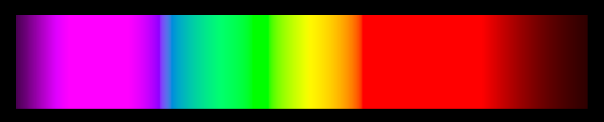
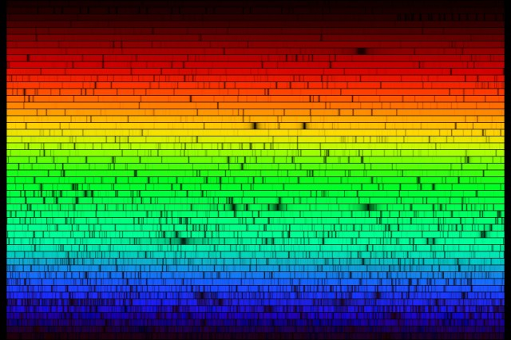
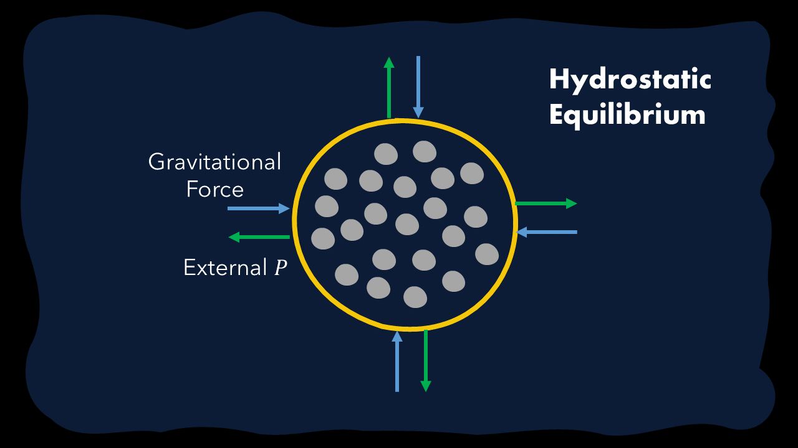
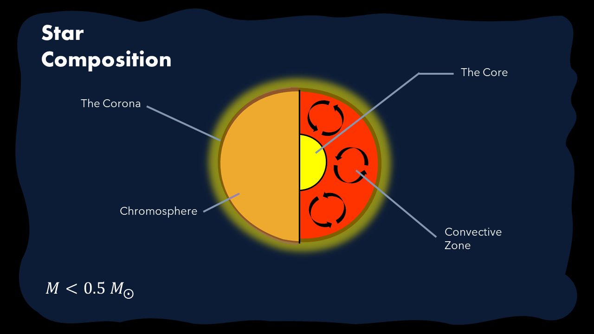
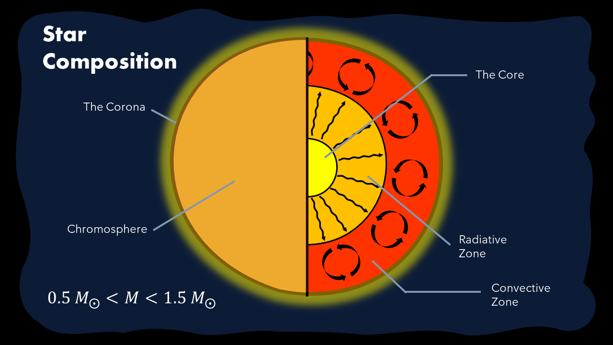
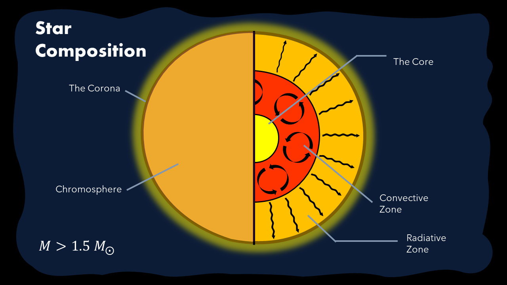

# Stellar Structure

## The History

While our understanding of physics has been largely predicated on results from the times of Aristotle, till now, Astronomy and **especially** Stellar Evolution has been a relatively new field of discovery.

While we may now have a **much** better understanding of stars, stars we've never been to or "in", for that matter, that wasn't the case even a century ago. In Einstein's time, the idea that the Sun was powered by a core where the very elements of Hydrogen came together in the proton-proton chain would be considered absurd, at best.

{ width="150", align=right }

Cecilia Payne was the true source behind our understanding of the stellar structure, an outspoken voice and truly extraordinary brain who, despite being bogged down by the then-sexist ideals of male supremacy, was able to not just make a crucial discovery, but also explain it in a way perhaps not done before.

## The Absorption Spectrum

In Stellar Spectroscopy, we follow the concept of **spectra**, which are crucial in not just seeing the variation of light but also in identifying specific elements that the origin is made of. Ideally any specific source should send a continuous spectrum of different lights, which looks as follows:

<p align="center">
    <br>
    <span>Figure 1.2.1 - The Continuous Spectra.</span>
</p>

??? Abstract "Code Used to Create the Plot above"

    ```python
    # Emission Spectra

    import np
    import matplotlib.pyplot as plt
    import pandas as pd

    LEN_MIN = 380
    LEN_MAX = 780
    LEN_STEP = 5

    X = np[
        0.000160, 0.000662, 0.002362, 0.007242, 0.019110, 0.043400, 0.084736, 0.140638, 0.204492, 0.264737,
        0.314679, 0.357719, 0.383734, 0.386726, 0.370702, 0.342957, 0.302273, 0.254085, 0.195618, 0.132349,
        0.080507, 0.041072, 0.016172, 0.005132, 0.003816, 0.015444, 0.037465, 0.071358, 0.117749, 0.172953,
        0.236491, 0.304213, 0.376772, 0.451584, 0.529826, 0.616053, 0.705224, 0.793832, 0.878655, 0.951162,
        1.014160, 1.074300, 1.118520, 1.134300, 1.123990, 1.089100, 1.030480, 0.950740, 0.856297, 0.754930,
        0.647467, 0.535110, 0.431567, 0.343690, 0.268329, 0.204300, 0.152568, 0.112210, 0.081261, 0.057930,
        0.040851, 0.028623, 0.019941, 0.013842, 0.009577, 0.006605, 0.004553, 0.003145, 0.002175, 0.001506,
        0.001045, 0.000727, 0.000508, 0.000356, 0.000251, 0.000178, 0.000126, 0.000090, 0.000065, 0.000046,
        0.000033
    ]

    Y = np[
        0.000017, 0.000072, 0.000253, 0.000769, 0.002004, 0.004509, 0.008756, 0.014456, 0.021391, 0.029497,
        0.038676, 0.049602, 0.062077, 0.074704, 0.089456, 0.106256, 0.128201, 0.152761, 0.185190, 0.219940,
        0.253589, 0.297665, 0.339133, 0.395379, 0.460777, 0.531360, 0.606741, 0.685660, 0.761757, 0.823330,
        0.875211, 0.923810, 0.961988, 0.982200, 0.991761, 0.999110, 0.997340, 0.982380, 0.955552, 0.915175,
        0.868934, 0.825623, 0.777405, 0.720353, 0.658341, 0.593878, 0.527963, 0.461834, 0.398057, 0.339554,
        0.283493, 0.228254, 0.179828, 0.140211, 0.107633, 0.081187, 0.060281, 0.044096, 0.031800, 0.022602,
        0.015905, 0.011130, 0.007749, 0.005375, 0.003718, 0.002565, 0.001768, 0.001222, 0.000846, 0.000586,
        0.000407, 0.000284, 0.000199, 0.000140, 0.000098, 0.000070, 0.000050, 0.000036, 0.000025, 0.000018,
        0.000013
    ]

    Z = np[
        0.000705, 0.002928, 0.010482, 0.032344, 0.086011, 0.197120, 0.389366, 0.656760, 0.972542, 1.282500,
        1.553480, 1.798500, 1.967280, 2.027300, 1.994800, 1.900700, 1.745370, 1.554900, 1.317560, 1.030200,
        0.772125, 0.570060, 0.415254, 0.302356, 0.218502, 0.159249, 0.112044, 0.082248, 0.060709, 0.043050,
        0.030451, 0.020584, 0.013676, 0.007918, 0.003988, 0.001091, 0.000000, 0.000000, 0.000000, 0.000000,
        0.000000, 0.000000, 0.000000, 0.000000, 0.000000, 0.000000, 0.000000, 0.000000, 0.000000, 0.000000,
        0.000000, 0.000000, 0.000000, 0.000000, 0.000000, 0.000000, 0.000000, 0.000000, 0.000000, 0.000000,
        0.000000, 0.000000, 0.000000, 0.000000, 0.000000, 0.000000, 0.000000, 0.000000, 0.000000, 0.000000,
        0.000000, 0.000000, 0.000000, 0.000000, 0.000000, 0.000000, 0.000000, 0.000000, 0.000000, 0.000000,
        0.000000
    ]

    XYZ = np.stack((X, Y, Z), axis=1)

    m = np.m[
        3.2404542, -1.5371385, -0.4985314:
        :-0.9692660,  1.8760108,  0.0415560:
        :0.0556434, -0.2040259,  1.0572252
    ].T

    def interpolate(values, index, offset):
        return values[index] + offset * (values[index+1]-values[index])/(LEN_STEP)

    def clip(x): return 1 if c > 1 else 0 if c < 0 else c

    def gammaCorrect(c):
        return 12.92 * c if c <= 0.0031308 else 1.055 * (c ** (1/2.4)) - 0.055

    def calc(length):
        if(LEN_MAX < length or length < LEN_MIN): return np[0, 0, 0]
        length -= LEN_MIN
        index = int(length/LEN_STEP)
        offset = length - LEN_STEP * index

        xyz = interpolate(XYZ, index, offset)

        rgb = np.clip(np.vectorize(gammaCorrect)(m @ xyz), 0, 1)

        return rgb


    waves = pd.Series(np.linspace(400, 700, 1000))

    colors = waves.apply(calc)

    fig, ax = plt.subplots(figsize=(30, 5))

    plt.rcParams['axes.facecolor']='black'
    plt.rcParams['savefig.facecolor']='black'

    plt.xlim((0, 1))
    plt.ylim((0, 1))

    plt.gca().spines['top'].set_visible(False)
    plt.gca().spines['bottom'].set_visible(False)
    plt.gca().spines['right'].set_visible(False)
    plt.gca().spines['left'].set_visible(False)

    plt.tick_params(axis='x', which='both', bottom=False, top=False, labelbottom=False)

    plt.tick_params(axis='y', which='both', left=False, top=False, labelleft=False)


    for i, color in enumerate(colors):
        plt.axvspan(i/1000, (i+1)/1000, facecolor=color)


    plt.savefig('continuousSpectrum')
    plt.show()
    ```


However, when you notice the spectra from the Sun itself, something starts making lesser sense.

<p align="center">
    <br>
    <span>Figure 1.2.2 - The Spectrum of the Sun.</span>
</p>

Why are there so many black lines? Why isn't it just blatantly continuous?

Well, simply put, these lines represent the photons that have been blocked while passing through the star, and as we'll later cover, it represents the constituent elements. The **stellar structure**.

The stellar structure is largely predicated by two distinct but important phenomena: **nuclear fusion** and **hydrostatic equilibrium**.

## Hydrostatic Equilibrium

<div align="center">
    <canvas id="myCanvas" width="500" height="465"></canvas>
    <div id="buttons">
    <button class='md-button quizNormal' id="play" onClick="play()">Play</button>
    <button class='md-button quizNormal' id="pause" onClick="pause()">Pause</button>
    <button class='md-button quizNormal' id="reset" onClick="reset()">Reset</button>
    </div>
<br>
     <div id="tempSlider">
      Temperature: Cold <input type="range" id="tempValue" min="0.6"
      max="3.4" value="1" step="0.05" oninput="changeTemp(this.value)" onchange="changeTemp(this.value)"> Hot &nbsp; &nbsp; &nbsp; &nbsp; &nbsp; &nbsp; &nbsp; &nbsp; &nbsp; &nbsp; &nbsp; &nbsp;
    </div>

    <p>
    Figure 1.2.1 - An Idealised Simulation of the Sun
    </p>


</div>

<script>
var canvas = document.getElementById("myCanvas");
var context = canvas.getContext("2d");
var simTitle = 'An Idealised Version of the Sun';

var time = 0.0;
var timer;
var runFlag = 1;
var numBalls = 200;
var diameter = 400;
var centerX = canvas.width/2;
var centerY = 235;
var ballRadius = 5;

var ball = new Array(numBalls);
for (var i = 0; i <= numBalls; i++) {
ball[i] = {};
ball[i].xValue = centerX;
ball[i].yValue = centerY;
ball[i].deltaX = -1.0+2.0*Math.random();
ball[i].deltaY = -1.0+2.0*Math.random();
ball[i].radius = ballRadius;
ball[i].color = "#242635";
}

var speedFactor = 1;
var overlap = create2DArray(numBalls,numBalls,0);
var oldOverlap = create2DArray(numBalls,numBalls,1);

runMotion();

function fill1DArray(length, init) {
    var x = new Array(length);
    for (var j = 0; j < length; j++) x[j] = init;
    return x;
}

function create2DArray(rows, columns, init) {
    var x = new Array(rows);
    for (var i = 0; i < rows; i++) x[i] = fill1DArray(columns, init)
    return x;
}

function drawMotion() {
    if (time >= 50) runFlag = 0;

    if (runFlag == 1) {
        context.clearRect(0, 0, canvas.width, canvas.height);
        
        context.fillStyle = "#242635";
        context.fillRect(0, 0, canvas.width, canvas.height);
        
        context.beginPath()
        context.arc(centerX, centerY, 0.5*diameter, 0, 2*Math.PI, false)
        context.fillStyle = "#F4C70A";
        context.fill()

        for (var i = 0; i<(numBalls-1); i++) {
            for (var j = i+1; j<numBalls; j++) {
                xDiff = ball[j].xValue-ball[i].xValue
                yDiff = ball[j].yValue-ball[i].yValue
                overlap[i][j] = ((xDiff*xDiff+yDiff*yDiff) < (2*ball[j].radius*2*ball[i].radius))*1;
                if ((overlap[i][j] == 1) && (oldOverlap[i][j] == 0)) {
                    vxi = ball[i].deltaX;
                    vyi = ball[i].deltaY;
                    
                    vxj = ball[j].deltaX;
                    vyj = ball[j].deltaY;

                    distance = Math.sqrt(xDiff*xDiff+yDiff*yDiff);
                    cosTheta = yDiff/distance;
                    sinTheta = xDiff/distance;

                    ball[i].deltaX = vxi + sinTheta*( -vxi*sinTheta + vxj*sinTheta - vyi*cosTheta + vyj*cosTheta);
                    ball[j].deltaX = vxj + vxi - ball[i].deltaX;
                    ball[i].deltaY = vyi + cosTheta*( -vyi*cosTheta + vyj*cosTheta - vxi*sinTheta + vxj*sinTheta);
                    ball[j].deltaY = vyj + vyi - ball[i].deltaY;
                }
                oldOverlap[i][j] = overlap[i][j];

            }
            
            ball[i].xValue = ball[i].xValue + speedFactor*ball[i].deltaX;
            ball[i].yValue = ball[i].yValue + speedFactor*ball[i].deltaY;

            let x = ball[i].xValue - centerX
            let y = ball[i].yValue - centerY

            let mag = Math.sqrt(x * x + y * y) + ball[i].radius

            if(mag > diameter*0.5) {
                console.log(`${ball[i].xValue} + ${ball[i].yValue} while ${diameter}`)
                uX = ball[i].deltaX
                uY = ball[i].deltaY
                uMag = Math.sqrt(uX*uX + uY*uY)

                pX = x
                pY = y
                pMag = Math.sqrt(pX*pX + pY*pY)
                phatX = pX/pMag
                phatY = pY/pMag

                proj = uX * phatX + uY * phatY
                projX = 2 * (uX - phatX * proj)
                projY = 2 * (uY - phatY * proj)

                dx = projX - uX
                dy = projY - uY
                if(Math.sqrt((x + dx)*(x+dx)+(y+dy)*(y+dy)) + ball[i].radius > diameter*0.5) {
                    ball[i].deltaX = -phatX * uMag
                    ball[i].deltaY = -phatY * uMag
                } else {
                    ball[i].deltaX = projX - uX
                    ball[i].deltaY = projY - uY
                }
                
            }

            context.fillStyle = ball[i].color;
            context.beginPath();
            context.arc(ball[i].xValue, ball[i].yValue, ball[i].radius, 0, 2 * Math.PI, false);
            context.fill();
        }

        context.font = 'bold 16pt Roboto';
        context.fillStyle = '#F4C70A';
        context.textAlign = 'center';
        context.fillText(simTitle, (canvas.width)/2, 25);
    }
}

function runMotion() {
    drawMotion();
    if (runFlag == 1) timer = window.setTimeout(runMotion, 20/60);
}
function changeTemp(newTempValue) {
    speedFactor = Math.sqrt(Number(newTempValue));
}


function play() {
    window.clearTimeout(timer);
    runFlag = 1;
    runMotion();
}

function pause() {
    window.clearTimeout(timer);
    runFlag = 0;
}


function reset() {
    window.clearTimeout(timer);
    time = 0.0;
    numBalls = 200;
    for (var i = 0; i < numBalls; i++) {
        ball[i].xValue = centerX;
        ball[i].yValue = centerY;
    }

    ball[0].deltaX = -1.0+2.0*Math.random();
    ball[0].deltaY = -1.0+2.0*Math.random();

    oldOverlap = create2DArray(numBalls, numBalls, 1)

    runFlag = 1;
    runMotion();
}
</script>

Consider a star as a singular container which holds a set of molecules together *in vacuum*. 

We know that this structure does NOT hold, since anything which holds a certain amount of molecules, $n$, exerts an outward pressure, $P$. The intuition behind this is the consistent collisions of molecules against the walls of the container, exerting a large force per unit area which leads to an outward pressure. 

To counteract this pressure, we suggest that these molecules are in fact giant masses, owing to us currently exploring how a star might work. If these molecules are so big, we know that there is a net inward gravitational force which suggests that we can counteract the outward pressure with "gravitational pressure". This is known as **hydrostatic equilibrium**.

A graphical representation of this can be seen below:

<p align="center">
<br>
<span>Figure 1.2.1 - Forces acting on our idealised depiction of a Star.</span>
</p>

## The Actual Structure of the Star

=== "$M < 0.5\text{ }M_\bigodot$"
    


=== "$0.5\text{ }M_\bigodot < M < 1.5\text{ }M_\bigodot$"
    

=== "$M > 1.5\text{ }M_\bigodot$"
    

<p align="center">
<span>Figure 1.2.2 - The Composition of a Star.</span>
</p>

### The Core

The core is the site of true **nuclear fusion**. This is where nuclear processes such as the **proton-proton chain**, **CNO cycle** and **triple alpha process** take place.

!!! Abstract "Note"
    For the sake of this article, we won't go in depth on the different reactions, as they will be brought up in later articles.

Notably, since there is a consistent gravitational compression, the pressure at the center of the star is the highest, thus the core is much hotter (by Gay-Lussac's Law). Hence, the highest star temperature is at the core, which nuclear fusion uses as a furnace!

#### The Convective Zone

The Convective Zone occurs when the gravitational compression is not so high such that atoms are broken down in electrons and nuclei. Convection occurs here, as hot plasma from the core slowly rises, taking the place of the denser, cooler plasma that falls back into the core. This way, energy is transferred slowly in the form of an adiabatic cooling cycle.

Notably, in different mass stars, this zone occurs at **different** locations, but no matter what, it always exists. Such cannot be said about the next:

### The Radiative Zone

The Radiative Zone is where you'd largely see heat being transferred via radiative transfer, in addition to thermal conduction. Notably, due to the immensely dense nature of the radiative zone, especially for main sequence stars, photons being transferred keep colliding with electrons which causes immense amounts of scatterings and this generally leads to most of the photons taking forever to get our of the zone. In addition, when they collide with the nuclei, the nuclei absorb most of the light, leaving only some to be emitted: *the emission spectra*.


??? Abstract "Optional Readings"
    ## The Key Equations
    There are four key differential equations that dictate the star's evolution history.

    ### The Equation of Mass Continuity
    Given a mass $M(r)$ is contained within a radius $r$, with density $\rho(r)$, we have:
    $$
    \frac{d}{dr} M(r) = 4\pi r^2 \rho(r)
    $$

    Nothing much is to be said here, except this result is very useful for the other 3 equations.

    ### The Equation of Hydrostatic Equilibrium

    For the above situation, it must be balanced by an outward gas pressure $P(r)$ such that:

    $$
    \begin{align*}
    \frac{d}{dr} P(r) &= - \rho(r) \frac{GM(r)}{r^2} \\
    \text{or otherwise, }\frac{dP}{dM} &= - \frac{GM(r)}{4\pi r^4} \\
    \text{We can hence solve this via:} \\
    4\pi \int_0^r r^4 \frac{dP}{dr} dr &= G \int_0^M M(r) dM \\
    4\pi (r^4 P(r) - 4\int_0^r r^3 P dr) &= G\frac{(M(r))^2}{2} \\ 
    \end{align*}
    $$

    ### The Equation of Energy Conservation

    Given a star has some outward luminosity, $L$ for a given mass $M(r)$ of density $\rho(r)$ and energy per unit mass per unit time $\varepsilon(r)$ (which is defined based on the chemical composition and mass, density and temperature), it holds that:

    $$
    \begin{align*}
    \frac{dL}{dr} &= 4\pi r^2 \rho(r) \varepsilon(r) \\
    \text{or by Eqn 1, }\frac{dL}{dM} &= \varepsilon(r)
    \end{align*}
    $$

    ### The Equation for Radiative Energy Transfer

    To represent the Temperature, $T(r)$ of this given star, based on the radiative energy transferred to that distance, in addition some radiative resistance $\kappa(r)$,

    $$
    \begin{align*}
    \frac{d}{dr} T(r) &= - \frac{3\kappa(r)\rho(r)L(r)}{16\pi r^2 ac (T(r))^3} \\
    \text{or by Eqn 1, }\frac{dT}{dM} &= -\frac{3\kappa(r)L(r)}{64\pi^2 acr^4 (T(r))^3}
    \end{align*}
    $$


## A Final Quiz
<script>
function markQ1(answer) {
    if(answer == 3) {
        document.getElementById("q1_4").classList.add("quizCorrect")
        let wrong = [1, 2, 3]
        for(i of wrong) {
            document.getElementById(`q1_${i}`).classList.add("quizIncorrect")
        }
        document.getElementById("q1_exp").style.visibility = "visible";
    } else {
        document.getElementById(`q1_${answer+1}`).classList.add("quizIncorrect")
    }
}

function markQ2(answer) {
    if(answer == 1) {
        document.getElementById("q2_2").classList.add("quizCorrect")
        let wrong = [1, 3, 4]
        for(i of wrong) {
            document.getElementById(`q2_${i}`).classList.add("quizIncorrect")
        }
        document.getElementById("q2_exp").style.visibility = "visible";
    } else {
        document.getElementById(`q2_${answer+1}`).classList.add("quizIncorrect")
    }
}
</script>

!!! Question "What counteracts the outward pressure of molecules in hydrostatic equilibrium?"
	<div align="center">
	<button class='md-button quizNormal' id="q1_1" onClick="markQ1(0)">Electromagnetic Force</button>
	<button class='md-button quizNormal' id="q1_2" onClick="markQ1(1)">Strong Force</button>
	<button class='md-button quizNormal' id="q1_3" onClick="markQ1(2)">Weak Force</button>
	<button class='md-button quizNormal' id="q1_4" onClick="markQ1(3)">Gravitational Force</button>
	<hr>
    <p class="quizExplanation invisible" id="q1_exp">The particles are not initially charged, and the strong and weak forces don't work in that manner.</p>
	</div>

!!! Question "Which of these is not a reaction that takes place in the core of a star?"
	<div align="center">
	<button class='md-button quizNormal' id="q2_1" onClick="markQ2(0)">Proton-Proton Chain</button>
	<button class='md-button quizNormal' id="q2_2" onClick="markQ2(1)">Nuclear Fission</button>
	<button class='md-button quizNormal' id="q2_3" onClick="markQ2(2)">CNO Cycle</button>
	<button class='md-button quizNormal' id="q2_4" onClick="markQ2(3)">Triple Alpha Ladder</button>
	<hr>
    <p class="quizExplanation invisible" id="q2_exp">Nuclear Fission does NOT take place inside the Sun, as Uranium is not present until the much later stages.</p>
	</div>
