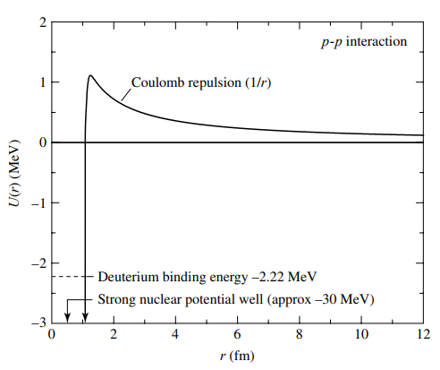

<!--Contributors: Khang -->
# Low-Mass Stars
!!! definition
	Stars that started out with mass in the range $0.08\ M_\odot$ to $2\ M_\odot$
	The dominant mechanism that converts *hydrogen into helium* in low-mass stars is the **pp-chain**, which implies that the cores of low-mass stars are **radiative**.

    </img>

A classic example of a **low-mass star** is our very own **sun**!

!!! caution
	Be sure to read [stellar structure](../preliminaries/stellar_structure) before proceeding with this one

## The Proton-Proton Chain
The **proton-proton chain** (or **pp-chain**) is the main mechanism that converts hydrogen into helium-4 in the cores of low-mass stars. In doing so, energy is released which fuels the star.
There are *three branches* of the pp-chain. However, they all start with the same two steps, the production of *deuterium* and *helium-3*
$$
^1_1\text{H} + ^1_1\text{H}\rightarrow\ ^2_1\text{H} + e^+ + \nu_e
$$
$$
^2_1\text{H} + ^1_1\text{H}\rightarrow\ ^3_2\text{He} + \gamma
$$
### PP I branch
This branch is the most typical branch that occurs for a **pp-chain**.
After the first two step, the following reaction occurs to give us *helium-4*
$$
^3_2\text{He} + ^3_2\text{He}\rightarrow\ ^4_2\text{He} + 2\ ^1_1\text{H}
$$
The overall **PP I** equation is given as
$$
4\ ^1_1\text{H}\rightarrow\ ^4_2\text{He} + 2e^+ + 2\nu_e + 2\gamma
$$
### PP II branch
As helium-3 and helium-4 is both produced in the core, they might collide to form beryllium, giving rise to the **PP II** branch. This will eventually give two *helium-4*'s
$$
^3_2\text{He} + ^4_2\text{He}\rightarrow\ ^7_4\text{Be} + \gamma
$$
$$
^7_4\text{Be} + e^-\rightarrow\ ^7_3\text{Li} + \nu_e\\
^7_3\text{Li} + ^1_1\text{H}\rightarrow\ 2\ ^4_2\text{He}
$$
### PP III branch
Beryllium-7 instead of capturing an electron as in step 2 of **PP II**, it might capture a proton instead, giving rise to the **PP III** branch.
$$
^7_4\text{Be} + ^1_1\text{H}\rightarrow\ ^8_5\text{B} + \gamma
$$
$$
^8_5\text{B} \rightarrow\ ^8_4\text{Be} + e^+ + \nu_e
$$
$$
^8_4\text{Be}\rightarrow\ 2\ ^4_3\text{He}
$$
Due to the slower speed of the proton as compared to the eletron, this branch is less likely to occur than the **PP II** branch.
### In the Sun
We include the following nice diagram from *Bradley's Introduction to Modern Astronomy* which illustrates the branches along with their probability of occuring in **the sun**

    </img>

## Temperature Requirement
For a **pp-chain** to occur, the colliding nuclei must overcome the electrostatic repulsion between them to get into the regime of the *strong nuclear force*, whereby the nuclei fuses, we call this energy barrier the **Coulomb barrier**.

    </img>

Classically, we would expect only nuclei that possesses kinetic energy that surpasses that of the *Coulomb barrier* to react. In which case, considering the reduced mass $\mu$ of two colliding particles give
$$
\frac{1}{2}\mu \overline v_{rel}^2 = \frac{1}{4\pi\epsilon_0}\frac{q_1q_2}{r}
\Rightarrow \frac{3}{2}kT = \frac{1}{4\pi\epsilon_0}\frac{q_1q_2}{r}
$$
$$
\Rightarrow T = \frac{1}{6\pi\epsilon_0}\frac{q_1q_2}{rk}\approx 10^{10}\quad \text{(for the sun)}
$$
However, from experimental observation, we find that pp-chain still happen in stars that operate at a temperatures much lower than this, for example our sun has a core temperature of $\approx 1.57\times10^{7} < 10^{10}$.
This is because, in real life, quantum effects allows the nuclei to **quantum tunnel** through the Coulomb barrier, resulting in a much lower required temperature of 
$$
T = \frac{q_1^2q_2^2\mu}{12\pi^2\epsilon_0^2h^2k}
$$
where
- $\mu$ is the reduced mass
- $\epsilon_0$ is vaccuum permittivity
- $h$ is the Planck constant
- $k$ is the Boltzmann constant
For context, this temperature comes out to $\approx 10^7$ for the sun, which agrees with our observations.

## Main-Sequence Evolution
As the **pp-chain** burns away hydrogen, the *mean molecular weight* of the core increases as we have substituted 4 lighter nucleus for 1 heavier nucleus.
The *mean molecular weight* $\mu$ is defined as
$$
\mu = \frac{\overline m}{m_H}
$$
where
- $\overline m$ is the average nuclear mass in the star
- $m_H$ is the mass of a hydrogen atom.
We know that the pressure at the core of the star is due to a combination of gas and radiation pressure, which is given by the **hydrostatic pressure equation**

$$
P = \frac{\rho kT}{\mu m_H} + \frac{1}{3}aT^4
$$
$$
\Rightarrow P \approx \frac{\rho kT}{\mu m_H}\quad \text{(at low temperatures)}
$$
where
- $\rho$ is the density of the star
- $k$ is the Boltzmann constant
- $T$ is the temperature
- $\mu$ is the *mean molecular weight*
- $m_H$ is the mass of a hydrogen atom
We also know that a star exists in a state of **hydrostatic equlibrium** where the pressure inside the star *fight against* the gravitational collapse of the star.

From the *pressure equation*, we see that as the *mean molecular weight* of the star increases the pressure will tend to decrease. As such, in order to maintain the pressure such that it can still support the weight of the star, either the *density* $\rho$ or the *temperature* $T$, or **both** must increase to compensate for the increase in $\mu$.
In this case both will increase in the following fashion. The decreased hydrostatic pressure becomes insufficient to fight against the gravitational collapse, thus the core compresses. As the core compresses the **density $\rho$ is increased**. Furthermore, this compression results in gravitational potential energy being released. By **virial theorem**, only half of the gravitational energy will be released in the form of radiation, with the other half being absorbed as heat which will **increase the temperature** $T$ of the star.
Now as the temperature is increased, there will be more parts of the star that reaches the [[#Temperature Requirement|temperature required]] to initiate hydrogen fusion, this causes there to be **more pp-chain reaction**.
Furthermore, the rate at which the pp-chain occurs is also **increased** as
$$
\text{rate of pp reaction} \propto \rho\mathcal X^2T^4
$$
where
- $\rho$ is the density
- $\mathcal X$ is the mole fraction of hydrogen
- $T$ is the temperature
Hence, more energy is produced per unit time and the power delivery of the star increases, causing it to **shine brighter**.

## Leaving the Main-Sequence
Eventually, the hydrogen at the core will be **depleted**, in which case the core will stop burning hydrogen and the core contracts due to gravitational collapse. This releases gravitational energy which heats up the outer envelope, which still contained hydrogen, causing hydrogen burning to resume.
This continued hydrogen burning of the outer envelope causes the **luminosity of the star to continue to rise**. Furthermore, some of the energy generated by the envelope goes back into heating itself which causes it to further expand.
The ash from the hydrogen burning in the envelope goes into **increasing the mass of the helium core**.

**Eventually the envelope of the star grows and cools sufficiently to become convective, in which case it has reached the Red Giant Phase**
[Next: Red Giant](../giants/red_giant.md)

### The Schönberg–Chandrasekhar Limit
The **Schönberg–Chandrasekhar limit** (SC limit) decribes the maximum ratio of *core mass* to *star mass* whereby the star is still able to support itself, it is given by
$$
\frac{M_{ic}}{M} = 0.37\left(\frac{\mu_{env}}{\mu_{ic}}\right)^2
$$
where
- $M_{ic}$ is the mass of the core
- $M$ is the mass of the star
- $\mu_{env}$ is the mean molecular weight of the envelope
- $\mu_{ic}$ is the mean molecular weight of the core

### Exceeding the SC Limit
Note, however, that the SC limit can be exceeded if there is another source of pressure supporting the weight of the star, aside from gas and radiation pressure.
This can occur in the star if the electrons in the gas become **degenerate**, which happens when the gas density is so high that the electrons are forced to occupy the *lowest possible energy state*.
However, due to **Pauli's exclusion principle**, which forbids electrons from occupying the same quantum state, the electrons will be stacked on progressively higher energy levels. This results in a sort of non-thermal **electron degeneracy pressure** which pushes against the gravitional collapse and allowing the star to **exceed the Schönberg–Chandrasekhar limit**

---
## Questions! :)

### Question 1: Low-Mass Stars
a) Are the cores of low-mass stars convective or radiative?  
b) What does it mean for a core to be convective?  
c) What does it mean for a core to be radiative?  

**Solutions**  
a) *They are radiative*  
b) *The energy of the core is transported by convection current of matter*  
c) *The energy of the core is transported through radiation and conduction*  

### Question 2: Pressure Integral
The pressure intergral computes the pressure distribution given some distribution function $n_pdp$
$$
P = \frac{1}{3}\int_0^\infty pvn_pdp
$$
Calculate the expression for the radiation pressure of a star

*Add solutions here later*

### Question 3: Virial Theorem
For an inverse square force, **virial theorem** states that
$$
E = \frac{1}{2} U
$$
$$
\text{total mechanical energy} = \frac{1}{2}\text{potential energy}
$$
Furthermore, given that the gravitational potential energy of two particles is given by
$$
U = -G\frac{Mm}{r}
$$
Find the total mechanical energy of a star given its mass $M$ and radius $R$

*Add solution here later*